# GDD - Game Design Document - Módulo 1 - Inteli

## Tilápia

#### Gabriel Henrique Martins Alves
#### Gabriel Scarpelin Diniz
#### Isabelly Maia Montalvão
#### Leonardo Casal Andriolo
#### Matheus Jorge Rosa
#### Pietra Pasqualini Batista

## Sumário

[1. Introdução](#c1)

[2. Visão Geral do Jogo](#c2)

[3. Game Design](#c3)

[4. Desenvolvimento do jogo](#c4)

[5. Casos de Teste](#c5)

[6. Conclusões e trabalhos futuros](#c6)

[7. Referências](#c7)

[Anexos](#c8)

<br>


# <a name="c1"></a>1. Introdução

## 1.1. Escopo do Projeto

### 1.1.1. Contexto da indústria

&nbsp;&nbsp;&nbsp;&nbsp;A Faculdade de Medicina da USP é uma referência no campo da educação superior, destacando-se no ensino de Medicina no Brasil e na realização de pesquisas de ponta, além de campanhas de conscientização para a população. Competindo com outras instituições renomadas, como UNICAMP, PUC-SP e UNIFESP, a FMUSP se destaca por suas iniciativas inovadoras e seu impacto notável no mercado regional e nacional, especialmente através de suas campanhas e atividades clínicas de alto padrão.

&nbsp;&nbsp;&nbsp;&nbsp;Internacionalmente reconhecida, a FMUSP continua a liderar o caminho em pesquisas de vanguarda, abrangendo áreas como cirurgia com células-tronco, desenvolvimento de pele artificial e outras tendências futuras na medicina.

### 1.1.2. Análise SWOT

&nbsp;&nbsp;&nbsp;&nbsp;A matriz SWOT é uma ferramenta de planejamento estratégico que ajuda as empresas na tomada de decisão. Esta metodologia divide-se em aspectos internos e externos, compreendendo forças (*strengths*) e fraquezas (*weaknesses*) para o ambiente interno, e oportunidades (*opportunities*) e ameaças (*threats*) para o externo, que têm por objetivo identificar os principais pontos de influência que afetam a empresa para uma clareza melhor de quais são os fatores que estão sob seu controle (internos) e os que não estão (externos).

&nbsp;&nbsp;&nbsp;&nbsp;Os aspectos externos se situam na esfera do que é praticamente incontrolável pela empresa, ao dependerem do meio em que ela está inserida e até mesmo, algumas vezes, do ambiente global. Desse modo, oportunidades são transformações que ocorrem no mercado e podem ser aproveitadas pela empresa pela tomada de um posicionamento mais favorável diante do que está ocorrendo. Em contrapartida, surgem as ameaças, as quais são fatores exógenos que colocam a empresa em uma situação de risco ou proporcionam maiores desafios para um bom desempenho mercantil.

&nbsp;&nbsp;&nbsp;&nbsp;Por outro lado, os fatores internos referem-se à esfera sob controle direto da empresa, ou seja, ela pode, no caso de fraquezas, tomar atitudes a fim de saná-los, ou potencializá-los, no caso de forças. Neste contexto, as forças correspondem a elementos que conferem vantagens competitivas perante os concorrentes, mas que sejam tão distintiva quanto possível em relação aos competidores para que, deste modo, possam representar um grande diferencial da empresa. Enquanto as fraquezas representam limitações ou desvantagens que fragilizam a corporação, prejudicam a dinâmica do negócio e seu posicionamento estratégico no mercado¹ (FERNANDES, Djair 2012).

&nbsp;&nbsp;&nbsp;&nbsp;Diante desse cenário, a matriz SWOT surge como uma ferramenta poderosíssima para uma parte crucial do posicionamento estratégico, a qual é compreender a interdependência desses componentes, uma vez que alterações em um deles impactam diretamente os demais. A estratégia eficaz, portanto, consiste em focalizar os fatores controláveis para permitir que a empresa alcance seus objetivos estratégicos. Por exemplo, enfrentar as ameaças é mais fácil pela mitigação das fraquezas, ao passo que a exploração mais eficiente das oportunidades é viabilizada pela potencialização das forças. Essa relação intrínseca simplifica a tomada de decisões, proporcionando ideias para a alocação mais produtiva de recursos e a determinação de prioridades. Fizz

<div align="center">

<sub>Figura 1 - Análise SWOT da FMUSP</sub>


<sup>Fonte: Material produzido pelos autores (2024)</sup></div>

&nbsp;&nbsp;&nbsp;&nbsp;Sob esse prisma, é possível traçar uma gestão mais eficiente dos recursos — que se apresentam como escassos — potencializando suas forças — como a internacionalização e o atendimento público — para aproveitar as oportunidades — como a quantidade de pessoas a serem atendidas — e se proteger das ameaças — como a retirada de verba por parte do governo. Ao examinar esse exemplo, é possível observar a clareza adquirida pelas informações ao serem submetidas a esse método e como em poucos minutos é possível traçar um plano de ação, tendo em vista a interdependência dos fatores endógenos e exógenos.

&nbsp;&nbsp;&nbsp;&nbsp;Com a análise SWOT, foi possível observar características importantes, tais como os projetos sociais realizados pela Faculdade de Medicina da USP (FMUSP) e a carência de ferramentas tecnológicas para esses projetos sociais. Associados a esses pontos, destacam-se algumas oportunidades, como o amplo público atendido pela FMUSP e, sobretudo, a crescente digitalização mundial. Nesse contexto, a aplicação gameficada foi desenvolvido com o objetivo de atenuar os pontos fracos, potencializar ainda mais os pontos fortes e aproveitar as oportunidades.

### 1.1.3. Descrição da Solução Desenvolvida

&nbsp;&nbsp;&nbsp;&nbsp;A falta de conscientização sobre prevenção, primeiros socorros e informações inadequadas sobre queimaduras, em especial em populações vulneráveis, influi na alta incidência de queimaduras, que se torna uma das maiores causas de lesões traumáticas no mundo.<br>

&nbsp;&nbsp;&nbsp;&nbsp;São registrados cerca de 1 milhão de novos casos anualmente no Brasil, conforme dados divulgados pelo Ministério da Saúde do Brasil em 2014, e acredita-se que 90% das queimaduras seriam evitadas com devida educação e conscientização da população. Grande parte das queimaduras registradas ocorrem em ambiente residencial e em atividades de lazer, abrangendo, em maioria, homens de 20 a 39 anos. [link TAPI]<br>

&nbsp;&nbsp;&nbsp;&nbsp;Considerando esse cenário, definimos como possível solução a criação de um jogo mobile educacional. Ele visa conscientizar a população, em especial as vulneráveis, sobre queimaduras, à medida que fornece informações embasadas para estimular a educação de prevenção de queimaduras, além de auxiliar nos primeiros socorros e desmitificar métodos inapropriados de tratamentos.<br>

&nbsp;&nbsp;&nbsp;&nbsp;Nossa solução busca criar os seguintes ganhos para nosso parceiro: conscientização de jovens e adultos, educação de maneira simples sobre a prevenção de queimaduras e promoção da Faculdade de Medicina da USP. Ademais, além de criar ganhos, buscamos também potencializá-los atráves da conscientização na prática, da criação de um diferencial tecnológico e da transmissão de conhecimento com diversão e lucidez.<br>

&nbsp;&nbsp;&nbsp;&nbsp;Além de criar ganhos, a solução busca também sanar alguns problemas que o parceiro possui como o baixo interesse das pessoas e a baixa disseminação de conhecimentos acerca do tema. Para isso, propomos criar um jogo que possui uma dinâmica de jogo capaz de reter a atenção do usuário, proporcionar uma experiência única e divertida e facilitar o acesso ao conhecimento atráves de plataforma mobile.<br>

&nbsp;&nbsp;&nbsp;&nbsp;O jogo deverá ser acessado pelos smartphones dos estudantes e poderá ser utilizado durante as campanhas de conscientização promovidas pela Faculdade de Medicina da USP ou quando da preferência do usuário. A solução impulsiona os benefícios já fornecidos pelas campanhas de conscientização e agrega um aspecto lúdico e divertido de compartilhar informações e combater desinformações. <br>

&nbsp;&nbsp;&nbsp;&nbsp;O critério de sucesso será a satisfação do jogador durante o processo de conscientização através de um game. Para avaliarmos tal critério, uma pesquisa de satisfação será realizada ao final do game, levando em consideração fatores como diversão, jogabilidade e transmissão de conhecimento.


### 1.1.4. Proposta de Valor

&nbsp;&nbsp;&nbsp;&nbsp;Um Canvas de Proposta de Valor é basicamente um mapa visual que ajuda a entender melhor o que torna um produto ou serviço valioso para os clientes. Imagine como um guia que organiza informações importantes sobre quem são seus clientes, o que eles precisam, e como seu produto ou serviço resolve seus problemas ou traz benefícios. É como uma caixa de ferramentas que permite às equipes reunirem suas ideias e pensarem de forma criativa sobre como podem oferecer valor aos seus clientes.

&nbsp;&nbsp;&nbsp;&nbsp;Usar um Canvas de Proposta de Valor é como criar uma história sobre como seu produto ou serviço faz a diferença na vida das pessoas. É uma conversa visual que ajuda as equipes a se concentrarem no que realmente importa: entender as necessidades dos clientes e encontrar maneiras inteligentes de atendê-las. É uma abordagem colaborativa que incentiva todos a contribuírem com suas ideias, garantindo que todos estejam na mesma página e trabalhando na mesma direção para oferecer algo que realmente importa para os clientes, ou seja, construir e consilidar sua proposta de valor.

&nbsp;&nbsp;&nbsp;&nbsp;A proposta de valor, é a essência do que um produto ou serviço oferece aos clientes e como atende às suas necessidades. Desenvolvida em torno do perfil do cliente e da proposta de valor da empresa, a proposta de valor busca alinhar os ganhos desejados, dores enfrentadas e trabalhos a serem realizados pelos clientes com os benefícios oferecidos, problemas resolvidos e produtos/serviços específicos da empresa. Essa ideia foi apresentada por Alexander Osterwalder e sua equipe em seu livro "Value Proposition Design: How to Create Products and Services Customers Want"².

<div align="center">

<sub>Figura 2 - Canvas da Proposta de Valor do Projeto</sub>


<sup>Fonte: Material produzido pelos autores (2024)</sup>
</div>

&nbsp;&nbsp;&nbsp;&nbsp;A partir do nosso Canvas de Proposta de Valor (CPV), determinamos essencialmente como o nosso produto ou serviço cria valor para os clientes. Isso inclui entender quem são os nossos clientes-alvo, quais são suas necessidades e desejos, e como o produto ou serviço oferecido atende a essas necessidades de uma forma única e convincente. Além disso, o CPV também nos ajuda a identificar como o nosso produto ou serviço se diferencia da concorrência e quais são os principais benefícios percebidos pelos clientes. 

&nbsp;&nbsp;&nbsp;&nbsp;As maneiras pelas quais nosso jogo se conecta com o perfil do cliente, solucionando suas principais necessidades e impulsionando seus atuais ganhos foram esclarecidas com a elaboração desse canvas. Uma estratégia para enfrentar o problema do cliente de maneira objetiva foi traçada em conjunto com a análise SWOT e, com base nessas informações, o desenvolvimento inicial foi iniciado. 

&nbsp;&nbsp;&nbsp;&nbsp;Tendo em vista o perfil do cliente analisado através do *value proposition canvas*, ao observarmos suas dores, ganhos e necessidades, desenvolvemos uma proposta de solução totalmente gamificada. Essa proposta visa envolver os jovens, proporcionando-lhes um ambiente divertido que cumpra o principal objetivo do projeto: a conscientização. Destacamos, sobretudo, a necessidade de algo versátil e atrativo para o público-alvo, oferecendo uma experiência única e divertida, a fim de disseminar entre diversas pessoas e conscientizar cada vez mais a população.

### 1.1.5. Matriz de Riscos

&nbsp;&nbsp;&nbsp;&nbsp;A matriz de risco é uma ferramenta amplamente utilizada em diversas indústrias para avaliar e priorizar riscos com base em sua probabilidade e impacto. Normalmente composta por uma tabela que categoriza os riscos em diferentes níveis, geralmente representados por cores ou valores numéricos⁴. A matriz de risco é iterativa por natureza, essa característica decorre da própria dinâmica do risco e da necessidade de reavaliação e refinamento contínuos visando seu aprimoramento. Ela é extremamente eficiente quando há necessidade de priorizar os riscos, sejam eles negativos (as ameaças) ou positivos (as oportunidades), ou seja, é excelente para analisar e visualizar quais riscos merecem mais atenção no momento, auxiliando na criação de planos de ação para prevenir ou potencializar tal risco⁵.

&nbsp;&nbsp;&nbsp;&nbsp;O aspecto iterativo da matriz de risco reconhece que os riscos não são estáticos, mas sim elementos que evoluem ao longo do tempo devido às mudanças no ambiente interno e externo de uma organização. Novos riscos podem surgir, riscos existentes podem mudar em probabilidade ou impacto, e medidas de mitigação podem se mostrar ineficazes ou requerer ajustes. Portanto, revisar e atualizar regularmente a matriz de risco garante sua relevância e reflexão precisa da paisagem de riscos atual.

&nbsp;&nbsp;&nbsp;&nbsp;Ademais, uma abordagem iterativa permite que as organizações melhorem continuamente seus processos de gestão de riscos. Ao revisar regularmente a matriz de risco, as instituições podem identificar áreas onde seus métodos de avaliação de risco podem ser aprimorados, como refinar critérios de risco, melhorar técnicas de coleta e análise de dados, ou aprimorar a comunicação e colaboração entre as partes interessadas. Esse ciclo iterativo de melhoria as auxilia a se adaptarem às circunstâncias voláteis, a anteciparem e responderem melhor a riscos emergentes.

&nbsp;&nbsp;&nbsp;&nbsp;A fim de gerenciar os riscos do nosso produto, a equipe construiu os gráficos que representam potenciais ameaças e oportunidades no projeto (figura 3 e figura 4, respectivamente), contribuindo efetivamente para a tomada de decisões estratégicas e planejamento de planos de ação. 

<div align="center">

<sub>Figura 3 - Matriz de Riscos</sub>


<sup>Fonte: Material produzido pelos autores (2024)</sup>
</div>

<div align="center">

<sub>Figura 4 - Matriz de Oportunidades</sub>

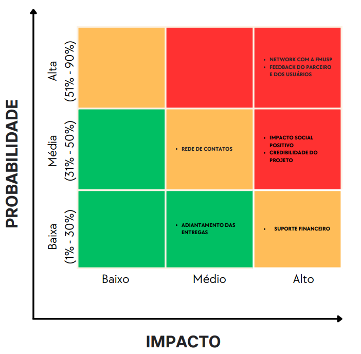

<sup>Fonte: Material produzido pelos autores (2024)</sup>
</div>

&nbsp;&nbsp;&nbsp;&nbsp;Deste modo, pode-se concluir que a matriz de risco pode ser aplicada em diversas áreas, inclusive em situações cotidianas. A análise de riscos pode ser útil para a tomada de decisão, ponderando seus riscos, ou seja, suas probabilidades e seus impactos; visando uma maior assertividade nesse processo decisório. A natureza iterativa da matriz de risco, portanto, não apenas a torna uma ferramenta valiosa para organizações em diferentes setores, mas também destaca sua utilidade potencial em contextos mais amplos, oferecendo uma estrutura sistemática para a gestão de riscos.

&nbsp;&nbsp;&nbsp;&nbsp;A análise dos riscos no projeto foi realizada com o objetivo de auxiliar o grupo a entender e lidar com possíveis ameaças e oportunidades. Sendo assim, conseguimos prever de forma mais eficaz certos eventos como, por exemplo, a possibilidade do usuário não entender a mecânica do jogo e criar, a partir dessa ameaça, um tutorial simples e esclarecedor. Além disso, foi possível visualizar que a parceria com a FMUSP gera um impacto social significante, indo de acordo com o que o projeto visa. Deste modo, chegamos nos seguintes planos de ação:

<div align="center">
<sub>Tabela 1: Requisitos do cliente</sub>
</div>


\# | Plano de ações:
--- | ---
1 | Atraso nas entregas dos afazeres: Apesar da equipe ser bem organizada com prazos e datas, o atraso nas entregas do backlog tem probabilidade de ocorrência média e impacto também médio. A solução ideal é realizar encontros breves diariamente (daily), para que todos os membros do grupo estejam cientes do andamento das funções individuais e coletivas, evitando sobrecargas e obstáculos desnecessários no desenvolvimento do projeto.
2 | Queda da internet durante o desenvolvimento do projeto: De forma geral, quedas e instabilidades na conexão estão fora do controle da equipe, sendo assim, não há efetivamente o que fazer além de esperar. No entanto, a probabilidade de que isso aconteça é baixa e o impacto seria médio, pois parte do desenvolvimento do projeto não requer uma conexão constante à internet.
3 | Falha no sistema do jogo: Para evitar falhas no sistema, a equipe realizará diversos testes para assegurar que tudo ocorrerá como o planejado. Caso aconteça algum imprevisto ou equívoco da nossa parte, realizaremos uma análise profunda para encontrar a raiz do problema e consertá-la.
4 | Não achar equilíbrio entre diversão e educação: Um dos nossos principais desafios é criar um jogo que conscientize a população, e que, ao mesmo tempo, seja divertido e envolvente. Caso o jogo seja focado na diversão, falharemos na entrega de educação, e vice-versa. Para tentar evitar ao máximo essa problemática, faremos testes com pessoas à nossa volta que sejam do público alvo do jogo para que termos críticas e feedbacks no que melhorar.
5 | O usuário não aprender com o jogo: Como um dos objetivos é a conscientização através do jogo, algumas soluções que a equipe entende como necessária e irá implementar para evitar o risco do usuário não aprender com o jogo são, garantir que o conteúdo educacional seja apresentado de maneira clara e concisa, aplicar o conhecimento adquirido em minigames durante o jogo e, utilizar de efeitos sonoros para indicar que uma ação foi satisfatória ou não. 
6 | Falta de comprometimento do grupo: A equipe está bastante empenhada para que o desenvolvimento do projeto seja o mais agradável possível, por isso essa problemática apresenta baixa probabilidade de ocorrência, no entanto, o impacto que a falta de comprometimento teria é alta e o melhor plano de ação para prevenir isso é a comunicação transparente e amigável entre os membros.
7 | Usuário sem acesso às tecnologias necessárias para jogar: Um dos principais motivos para a criação desse jogo é com o intuito de levar o conhecimento a todos, mas principalmente para aqueles que não tem fácil acesso à educação. Por esse motivo, a acessibilidade é uma prioridade e preocupação para a equipe. Para atingir  o máximo de usuário possível, a equipe tentará de tudo para oferecer o jogo além de mobile, mas que também funcione em uma versão web. Além disso, o jogo poderá ser executado em dispositivos mais antigos e que tenham menos capacidade de processamento. 
8 | Problemas com a trilha sonora: Uma ameaça de probabilidade e impacto baixos, pois se houver qualquer imprevisto com a trilha sonora, isso não irá impactar a mensagem ou a jogabilidade do jogo. O plano de ação é analisar e entender a raiz do problema e efetuar as alterações necessárias, além de realizar diversos testes em dispositivos diferentes.
9 | Erros/Alterações visuais (ex: erros gramaticais): Ainda que a equipe Tilápia seja cuidadosa, é normal que aconteçam erros e alterações visuais durante o desenvolvimento do jogo. Por se tratar de falhas relativamente simples de serem resolvidas, o impacto acaba sendo baixo. A solução mais eficiente para ambos é a atenção redobrada para evitar erros e, no caso das alterações puramente estéticas, para não tirar o foco do que realmente importa.
10 | O usuário não se engaja com o jogo: Por ser um jogo com o intuito educativo, é possível que haja problemas no engajamento do usuário. Para evitar ao máximo essa problemática, a equipe desenvolverá no jogo elementos de recompensa para motivar o usuário, como por exemplo, método de pontuação e vida, quiz e tempos limitados para a realização dos objetivos. Além disso, o jogo fica cada vez mais desafiador à medida que o jogador ganha experiência e familiaridade. 
11 | Sobrecarga em relação à habilidades (ex: membros que sabem programar melhor que outros): A probabilidade de haver uma sobrecarga de funções nos membros que têm mais facilidade e familiaridade com programação é alta, no entanto isso terá um impacto significativo à medida que as responsabilidades ficarão desproporcionais em relação ao resto do grupo. Para esse problema, a solução é misturar o grupo para que todos trabalhem em todas as áreas do projeto, mesmo aqueles que têm dificuldades.
12 | O usuário tem dificuldade em entender a dinâmica e mecânica do jogo: Entender como se joga um jogo é essencial para o sucesso do mesmo e a falha na compreensão pode gerar estresse e desinteresse. Para que isso não aconteça, a jogabilidade deve estar alinhada com nível do usuário e o tutorial deve ser bem informativo e esclarecedor, para que o jogo siga um fluxo divertido e intuitivo.
13 | Concorrência com outros jogos: A concorrência com outros jogos é um risco de probabilidade alta e impacto também alto, visto que poderíamos perder clientes, dito isso, uma solução viável seria desenvolver novas estratégias de marketing para o jogo e garantir atualizações que inovem o produto.

## 1.2. Requisitos do Projeto

&nbsp;&nbsp;&nbsp;&nbsp;Esta seção tem como objetivo fornecer uma visão abrangente e detalhada dos requisitos essenciais que orientarão o desenvolvimento do projeto. Aqui, serão delineadas as funcionalidades, características e restrições fundamentais para garantir a compreensão unificada entre a equipe de desenvolvimento e o cliente.

<div align="center">
<sub>Tabela 2: Requisitos do cliente</sub>
</div>

\# | Requisito do cliente 
--- | ---
1|Ensinar quais são as três camadas da pele;
2|Falar sobre a espessura das camadas da pele e qual a relação delas com os tipos de queimadura;
3|Definir os diferentes tipos de queimadura;
4|Dizer por que uma queimadura profunda não dói;
5|O jogo deve ser compatível com mobile;
6|A paleta de cores deve ser vibrante e atraente para o público do jovem;
7|Tempo limitado apenas com a intenção de capacitação, sendo uma experiência única de aprendizado;
8|Jogo tem de atrair o interesse dos alunos;
9|Deve ter recompensas, pontuação, recordes;
10|Pode ser expandido para fora das escolas;
11|O jogo não aborda formas de tratamento;
12|Focar na prevenção e no que NÃO fazer;
13|Desmistificação de mitos.
<div align="center">
<sub>Tabela 3: Requisitos do cliente</sub>
</div>

\# | Requisito do grupo 
--- | ---
1 | No jogo deve ser implementado um menu inicial com um botão “inciar”;
2 |O jogo deve conter o pátio da faculdade como cenário, uma interação com NPC para acessar um case, uma tenda com questionário e uma tenda com livros para se adquirir conhecimento;
3 |Deve ser adicionado ao jogo um sistema de recompensa tendo como base o tempo de resolução do case e os acertos no questionário;
4 |Adicionar efeitos sonoros, música de fundo por meio do framework phaser; 
5 |Deve ter animações que serão feitas com spritesheet;
6 |Irá conter uma arte gráfica pixelada, feita com auxílio do piskel;
7 |Inputs de movimentação com o touch screen de dispositivos mobile
8 |Implementação de movimento vetorial para normalização de velocidade;
9 |Programar mudança de cenas para ter um código funcional do menu;
10 |Adicionar animações ao personagem com spritesheet;
11 |Adicionar tecla de input para interação com outros objetos ou personagens;
12 |Fazer quiz na tenda de livros com mudança de cenas;
13 |O jogo deve ser rápido, com um tempo de duração de em média 15 minutos;
14 |Terá possibilidade de rejogabilidade;
15 |Adquirir pontos em forma de conhecimento;
16 |Ter elemenos da Faculdade de Medicina da USP, entre outras referências;
17 |Ter uma grande sala com foco no personagem, utilizando dinâmica de câmeras;
18 |Caixa de diálogo com NPC para instruir o personagem principal sobre quais serão seus próximos passos.

&nbsp;&nbsp;&nbsp;&nbsp;Listar esses pontos em uma tabela auxiliou o grupo a se organizar melhor para a produção de requisitos alinhados com os do cliente e a ter um maior entendimento do projeto, visando sempre o atenditmento dos pedidos do cliente. E, ao mesmo tempo, ajudou o grupo a organizar as tarefas de forma eficiente, ou seja, abrangendo todos os pontos listados e propotcionando uma divisão igualitária dessas tarefas.

## 1.3. Público-alvo do Projeto

&nbsp;&nbsp;&nbsp;&nbsp;De acordo com Kotler (2000)⁵, também conhecido como o “pai do marketing”, o público alvo é o grupo de consumidores que possui necessidades semelhantes àquelas que a empresa atende. O público alvo pode ser dividido em diversos fatores tais quais: geografia, demografia, psicografia e comportamento⁶. 

&nbsp;&nbsp;&nbsp;&nbsp;O nosso jogo é pensado e destinado à adolescentes e jovens adultos que fazem parte de comunidades e regiões carentes com acesso limitado à educação, visto que o objetivo principal do projeto é a conscientização e 90% dos incidentes envolvendo queimaduras são reportados em locais onde a população é leiga⁷. 


&nbsp;&nbsp;&nbsp;&nbsp;Portanto, para que a magnitude da influência e impacto gerado do nosso produto seja positiva, definimos o público alvo levando em consideração os aspectos demográficos, especificamente a idade, renda e educação. 
Posto isso, foi entendido que a definição adequada do público alvo aumenta a magnitude da influência e impacto gerado, o que vai de acordo com o nosso objetivo principal.

# <a name="c2"></a>2. Visão Geral do Jogo

## 2.1. Objetivos do Jogo

&nbsp;&nbsp;&nbsp;&nbsp;O objetivo de um jogo geralmente é a meta que os jogadores devem alcançar para vencer ou progredir. Pode envolver completar tarefas específicas, resolver quebra-cabeças, derrotar inimigos, acumular pontos, entre outros desafios.

&nbsp;&nbsp;&nbsp;&nbsp;Para o nosso jogo, o objetivo é resolver o máximo de cases propostos pela dra. Tina em um tempo determinado, passando por um ciclo de teoria (representada pelos livros da tenda de livros) e de prática (representada pelo quiz da tenda de quiz), obtendo assim uma pontuação final que pode ser superada a cada novo ciclo. Isso incentiva que os jogadores equilibrem eficiência na resolução e aprimoramento de habilidades através da aprendizagem.

## 2.2. Características do Jogo

### 2.2.1. Gênero do Jogo

&nbsp;&nbsp;&nbsp;&nbsp;O gênero se refere à classificação ou categoria que descreve o estilo e a mecânica de jogo predominantes. Cada gênero tem características específicas que definem como os jogadores interagem com o jogo e o que podem esperar dele em termos de jogabilidade, narrativa e objetivos⁸.

&nbsp;&nbsp;&nbsp;&nbsp;O nosso jogo simula a atuação de um estudante de ensino médio durante uma gincana promovida por uma faculdade, portanto seu gênero é simulação. Como tal, o jogo oferece uma experiência imersiva e educativa, onde o jogador pode aprender sobre prevenção de queimaduras e sobre o que deve-se ou não fazer logo após se queimar.

### 2.2.2. Plataforma do Jogo

&nbsp;&nbsp;&nbsp;&nbsp;A plataforma de um jogo se refere ao ambiente ou sistema no qual o jogo é executado. Isso inclui dispositivos como computadores, consoles de videogame, smartphones, tablets, entre outros, e também o sistema operacional ou plataforma online que suporta a execução do jogo.

&nbsp;&nbsp;&nbsp;&nbsp;O jogo será desenvolvido para dispositivos móveis, como smartphones e tablets, e oferecerá uma experiência acessível e portátil. A interface será otimizada para telas sensíveis ao toque, permitindo aos jogadores interagirem intuitivamente com os elementos do jogo. Além disso, a natureza móvel desses dispositivos permitirá que os jogadores acessem o jogo em qualquer lugar, tornando-o conveniente para ser usado na educação.

&nbsp;&nbsp;&nbsp;&nbsp;A aplicação também poderá ser acessado via web, oferecendo flexibilidade adicional aos jogadores, que poderão jogar diretamente de seus navegadores sem a necessidade de downloads adicionais. Isso tornará o jogo acessível a uma ampla gama de dispositivos, garantindo que mais pessoas possam participar e aprender sobre a importância da prevenção de queimaduras.

### 2.2.3. Número de jogadores

&nbsp;&nbsp;&nbsp;&nbsp;O número de jogadores de um jogo refere-se à quantidade de participantes que podem jogar simultaneamente ou de forma sequencial. Esse aspecto é fundamental na definição da dinâmica do jogo, determinando se é um jogo para um único jogador, para dois jogadores, ou para múltiplos jogadores. O número de jogadores pode influenciar elementos como competição, colaboração, estratégia e interação social dentro do jogo.

&nbsp;&nbsp;&nbsp;&nbsp;No contexto do nosso jogo sobre prevenção de queimaduras, a opção de um jogador oferecerá uma experiência individualizada e centrada no aprendizado. Isso permitirá um foco maior na absorção de informações e na prática de habilidades específicas, como identificar riscos de queimaduras e tomar decisões preventivas adequadas. Além disso, jogar sozinho pode facilitar a personalização da experiência de acordo com o ritmo e as necessidades individuais do jogador.

### 2.2.4. Títulos semelhantes e inspirações 

&nbsp;&nbsp;&nbsp;&nbsp;Títulos semelhantes e inspirações de um jogo referem-se a outros jogos que compartilham características, temas, mecânicas de jogo ou atmosfera semelhantes com o jogo que está sendo desenvolvido. Ao analisar títulos semelhantes, podemos identificar elementos que foram bem-sucedidos em outros jogos e incorporá-los ao nosso próprio projeto. Já as inspirações nos forneceram uma fonte de criatividade e direção para o desenvolvimento do jogo.

&nbsp;&nbsp;&nbsp;&nbsp;Para a concepção do jogo, foram utilizados os seguites jogos como referência de jogabilidade e design:

* [Overcooked](https://www.team17.com/games/overcooked/)<br>
* [Hospital Questiona](https://metodoquestiona.com.br/)<br>
* [Stardew Valley](https://www.stardewvalley.net/)<br>

### 2.2.5. Tempo estimado de jogo (sprint 5)

*Ex. O jogo pode ser concluído em 3 horas passando por todas as fases.*

*Ex. cada partida dura até 15 minutos*

# <a name="c3"></a>3. Game Design

## 3.1. Enredo do Jogo

&nbsp;&nbsp;&nbsp;&nbsp;No jogo "Turma da Prevenção: Com queimadura não se brinca", os jogadores entram em uma aventura imersiva da vida de Lipe, um estudante de ensino médio em uma escola pública muito dedicado e competitivo. O sonho de Lipe é se tornar um médico e por isso participa da dinâmica proposta pela Dra. Tina, uma renomada médica do Hospital das Clínicas. 

&nbsp;&nbsp;&nbsp;&nbsp;No Dia da Prevenção, a Faculdade de Medicina da USP abriu as portas para receber alunos de todas as escolas, com o objetivo de conscientizá-los acerca do tema das queimaduras. Durante a dinâmica, Lipe vai entrar em contato com casos reais de pessoas que sofreram lesões de queimadura e vai estudar cada um deles minuciosamente, desbravando a literatura acerca do tema. A dinâmica irá testar seus conhecimentos adquiridos por meio de um jogo desafiador de perguntas e respostas. À medida em que o jogo avança, Lipe vai compreendendo os perigos e cuidados relacionados às queimaduras, desmitificando crenças populares e absorvendo conhecimento valioso, além de entender a importância da prevenção.


## 3.2. Personagens

### 3.2.1. Controláveis

&nbsp;&nbsp;&nbsp;&nbsp;O termo "personagem controlável" refere-se àqueles avatares que são comandados pelo jogador através de comandos de movimento, ações, combate, dentre outros⁹.

&nbsp;&nbsp;&nbsp;&nbsp;O jogo referido neste documento terá somente um único personagem controlável, o Lipe. Lipe é um aluno dedicado que está no ensino médio de uma escola pública e participará de uma dinâmica proposta pela Dra. Tina dentro do campus da Faculdade de Medicina da USP. O personagem sonha em um dia ser médico, então está animado para os desafios que lhe serão apresentados. Lipe irá estudar os cases que serão fornecidos pela Dra. Tina e terá como objetivo concluir o maior número de cases em um tempo estabelecido. 

### 3.2.2. Non-Playable Characters (NPC)


&nbsp;&nbsp;&nbsp;&nbsp;*Non-Playable Characters* (*NPCs*) são avatares os quais o jogador não possui controle sobre, portanto não comanda seus movimentos nem ações⁹. Porém, é possível interagir com eles se forem programados para isso, como é o caso da Dra. Tina. Em nosso projeto, utilizaremos 11 *NPCs*, dos quais 10 deles serão estudantes e, como o Lipe, participarão da dinâmica. Desde modo, poderão ser obstáculos para o trajeto do jogador durante o jogo. Já a  Dra. Tina é uma *NPC* que fica situada somente em um lugar, no entanto ela é a única com a qual se pode interagir, visto que é a responsável por entregar os cases aos alunos. Fizz


<div align="center">
<sub>Tabela x: Descrição dos NPCs do jogo</sub>
</div>

\# | NPC | Função | Imagem
--- | --- | --- | --- 
1 | Dra. Tina | Instruir os alunos e entregar os cases | 
2 | Isa | Preencher o mapa e atrapalhar o jogador ao participar da dinâmica | 
3 | NPC 03 | Preencher o mapa e atrapalhar o jogador ao participar da dinâmica | 
4 | NPC 04 | Preencher o mapa e atrapalhar o jogador ao participar da dinâmica | 
5 | NPC 05 | Preencher o mapa e atrapalhar o jogador ao participar da dinâmica | 
6 | NPC 06 | Preencher o mapa e atrapalhar o jogador ao participar da dinâmica | 
7 | NPC 07 | Preencher o mapa e atrapalhar o jogador ao participar da dinâmica | 
8 | NPC 08 | Preencher o mapa e atrapalhar o jogador ao participar da dinâmica | 
9 | NPC 09 | Preencher o mapa e atrapalhar o jogador ao participar da dinâmica | 
<div align="center">
<sup>Fonte: Material produzido pelos autores (2024)</sup>
</div>


### 3.2.3. Diversidade e Representatividade dos Personagens

&nbsp;&nbsp;&nbsp;&nbsp; De acordo com o nosso público-alvo, o jogo em questão não apenas oferecerá uma variedade de personagens, mas também buscará causar um impacto social por meio da inclusão e diversidade. A personagem Dra. Tina foi criada para representar uma parcela significativa da população brasileira: pessoas pardas/pretas, conforme indicado pelo Censo de 2022. Nossa abordagem visa não apenas incluir personagens pretos como secundários, mas também posicioná-los como protagonistas da história. Assim, a Dra. Tina desempenha o papel principal ao guiar o personagem principal durante toda a jornada, fornecendo instruções e sendo a figura central por trás de todos os eventos que ocorrem dentro do jogo. Além disso, o projeto visa abordar outras raças e diferentes culturas nos personagens, e a expectativa é que, com o avanço do projeto, os NPCs sejam desenvolvidos para representar ainda mais parcelas da população sub-representadas.

## 3.3. Mundo do jogo

### 3.3.1. Locações Principais e/ou Mapas

&nbsp;&nbsp;&nbsp;&nbsp;O jogo se passa em um fase única e cíclica composta pelos seguintes ambientes:

&nbsp;&nbsp;&nbsp;&nbsp;Faculdade de Medicina da USP: localização onde o jogo se passa, inspirada no prédio real da Universidade de São Paulo, e sedia o dia de prevenção contra queimaduras.

&nbsp;&nbsp;&nbsp;&nbsp;Dra. Tina: onde os cases são visualizados e atribuídos ao jogador, que, no papel de estudante, irá investigar sobre a situação.

&nbsp;&nbsp;&nbsp;&nbsp;Tenda de Livros: um ambiente onde o jogador pode acessar informações sobre prevenção de queimaduras e procedimentos de primeiros socorros de acordo com o case investigado.

&nbsp;&nbsp;&nbsp;&nbsp;Tenda de Quiz: lugar em que o jogador aplica os conhecimentos adquiridos para que conclua a investigação do case atribuído a ele.

<div align="center">

<sub>Figura 5 - Mapa do Jogo</sub>

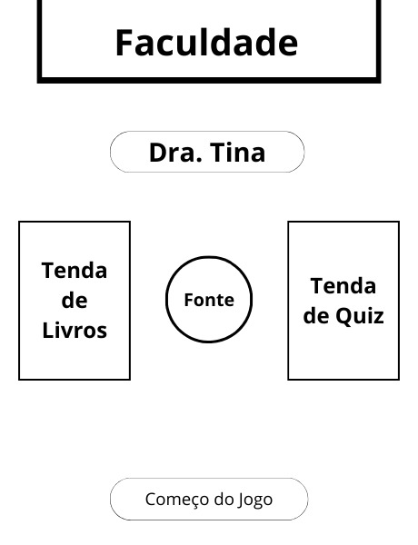

<sup>Fonte: Material produzido pelos autores (2024)</sup>
</div>

### 3.3.2. Navegação pelo mundo

&nbsp;&nbsp;&nbsp;&nbsp;O jogador controla um estudante do ensino médio utilizando um controle direcional na tela de seu dispositivo móvel. Tocando no controle e arrastando o dedo na direção desejada, a movimentação do personagem é ativada e é possível navegar livremente dentro dos limites do cenário, além de interagir com objetos e personagens por meio de colisões.

&nbsp;&nbsp;&nbsp;&nbsp;No jogo, não há separação de salas ou níveis, ou seja, o jogador pode navegar livremente pelo mapa. No entanto, para interagir com alguns objetos e acessar certas funcionalidades, existem condições específicas a serem cumpridas.

&nbsp;&nbsp;&nbsp;&nbsp;Ao estudante encostar na Dra. Tina, um case é aberto para visualização e é atribuído ao jogador para ser solucionado. Após análise do case, o jogador deve se locomover à Tenda de Livros.

&nbsp;&nbsp;&nbsp;&nbsp;A Tenda de Livros está disponível para o jogador a qualquer momento. Para acessar as informações, basta colidir com a tenda. 

&nbsp;&nbsp;&nbsp;&nbsp;O jogador deve colidir com a Tenda de Quiz para iniciar um jogo de perguntas. As perguntas variam de acordo com o case fornecido, tornando essa funcionalidade disponível apenas após a atribuição de um case ao estudante. 

&nbsp;&nbsp;&nbsp;&nbsp;O jogador retorna a Dra. Tina para a entregar o case resolvido, dando início à um novo ciclo de jogo após a Dra. atribuir mais um case ao estudante.


### 3.3.3. Condições climáticas e temporais

&nbsp;&nbsp;&nbsp;&nbsp;No jogo, o tempo é um elemento que adiciona diversão e desafio à experiência do jogador. 
Um cronômetro é utilizado para medir o tempo que o jogador tem para completar cada ciclo de aprendizado e resolução do case na gincana. 

&nbsp;&nbsp;&nbsp;&nbsp;O desafio está em cumprir o máximo de ciclos no tempo estipulado, o que cria uma sensação de urgência e emoção. O jogador é recompensado com pontuações mais altas por sua eficiência e rapidez, incentivando repetições para melhorar o desempenho. No entanto, erros resultam na perda de tempo, tornando essencial tomar decisões cuidadosas e precisas durante o jogo. 

&nbsp;&nbsp;&nbsp;&nbsp;Em resumo, o cronômetro adiciona dinamismo e intensidade à jogabilidade, mantendo os jogadores engajados e focados em suas tarefas.

### 3.3.4. Concept Art

&nbsp;&nbsp;&nbsp;&nbsp;As Concepts Arts são desenhos desenvolvidos com o objetivo de conceituar elementos do jogo como personagens, itens, cenários, etc¹⁰. Para nosso jogo, as concepts arts desenvolvidas estão listadas abaixo:
Fizz
<div align="center">

<sub>Figura 6 - Concept Art do Mapa</sub>

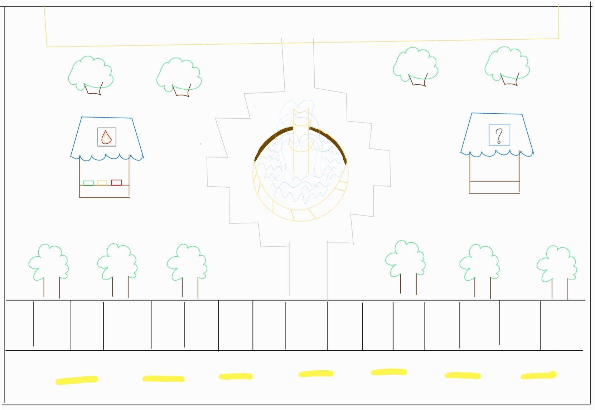

<sup>Fonte: Material produzido pelos autores (2024)</sup>

</div>

&nbsp;&nbsp;&nbsp;&nbsp;Figura 6: O mapa principal do jogo retrata o pátio da Faculdade de Medicina da Universidade de São Paulo. O espaço é arborizado, com duas tendas em cada extremidade e uma fonte central. Um portão separa o pátio da rua adjacente.

<div align="center">

<sub>Figura 7 - Concept Art do Case</sub>

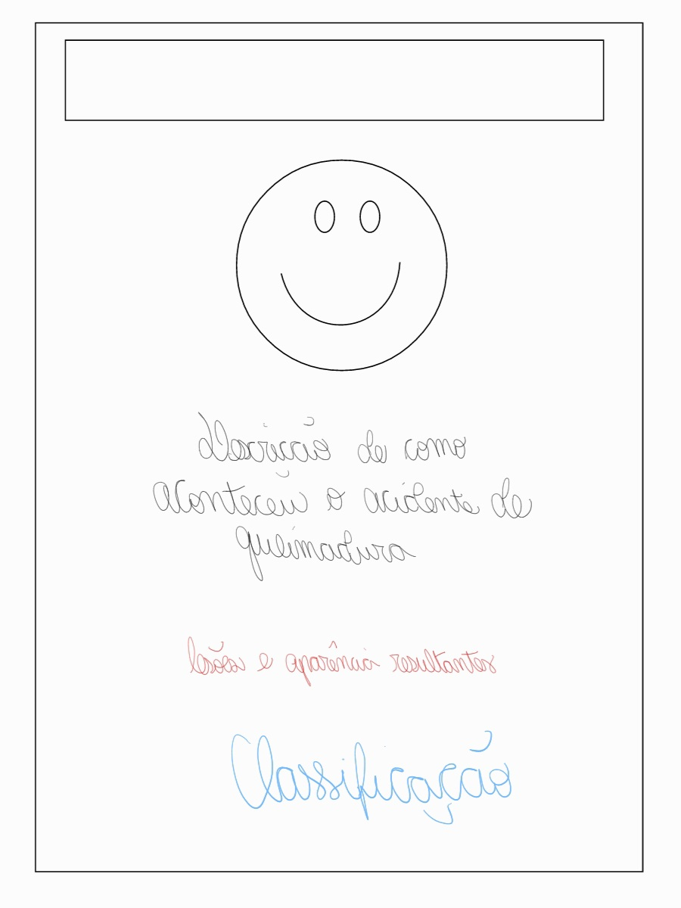

<sup>Fonte: Material produzido pelos autores (2024)</sup>

</div>

&nbsp;&nbsp;&nbsp;&nbsp;Figura 7: Na parte superior do case há um quadro e uma foto há serem preenchidos com o nome e imagem do paciente respectivo. Logo abaixo, há uma descrição de como ocorreu o acidente de queimadura seguido das lesões sofridas e a classificação do machucado.

<div align="center">

<sub>Figura 8 - Concept Art de Livros</sub>

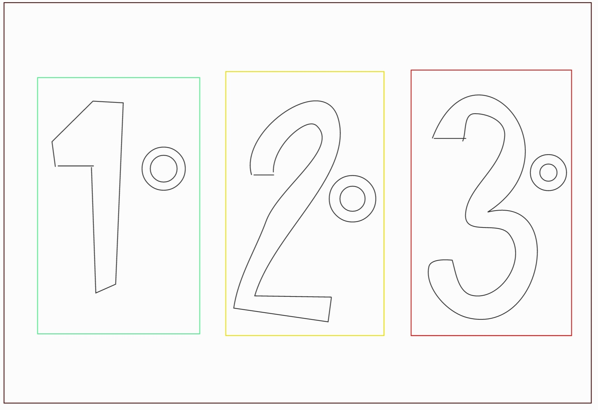

<sup>Fonte: Material produzido pelos autores (2024)</sup>

</div>

&nbsp;&nbsp;&nbsp;&nbsp;Figura 8: Os livros são dispostos em ordem crescente quanto ao seu grau de classificação começando pela esquerda. Cada um indica na capa a qual grau se refere e contém uma cor única.

<div align="center">

<sub>Figura 9 - Concept Art do Quiz</sub>

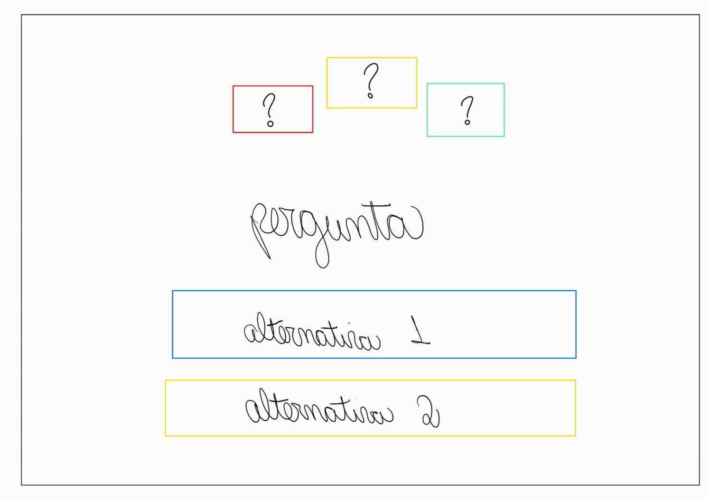

<sup>Fonte: Material produzido pelos autores (2024)</sup>

</div>

&nbsp;&nbsp;&nbsp;&nbsp;Figura 9: O quiz é um quadrado que contém, começando pela parte superior, três figuras em forma de retângulos com um símbolo de interrogação no centro. Em seguida, há uma área de pergunta a ser desenvolvida e duas caixas com opções de alternativa.

### 3.3.5. Trilha sonora

&nbsp;&nbsp;&nbsp;&nbsp;As trilhas sonoras são meios de envolver o usuário no jogo, segundo o artigo "The Role of Music in Videogames" - O papel da música nos videogames - cujo autor, citado no artigo da BBC ¹⁴, afirma que as trilhas sonoras nos jogos são multifuncionais, pois significam várias coisas para o jogador. Isso inclui o aumento da imersão, as brechas para mudanças na história, além de contribuírem também para a estética do jogo, tornando-se assim um fator muito importante para o envolvimento do jogador na narrativa.

<div align="center">
<sub>Tabela X: Lista de músicas</sub>
</div>

\# | Título | Ocorrência | Autoria
--- | --- | --- | ---
1 | Tema de abertura e durante o tutorial | Tela de início e Cena da faculdade | FoolBoyMedia (CC BY-NC 4.0)
2 | Tema principal | Cena da faculdade após a introdução | BloodPixelHero (CC BY 4.0)

&nbsp;&nbsp;&nbsp;&nbsp;Tendo como referência o artigo mencionado, as músicas selecionadas foram cuidadosamente escolhidas para transmitir a atmosfera do jogo, com o objetivo de proporcionar uma imersão mais profunda por parte do jogador. No menu e no tutorial, optamos por músicas com ritmo mais lento, oferecendo uma introdução tranquila e acolhedora ao universo do jogo. No entanto, à medida que a dinâmica do jogo se intensifica, marcada pelo início do cronômetro e pelo aumento da velocidade das ações, uma trilha sonora com batidas mais pulsantes é ativada, elevando a energia e a intensidade da experiência de jogo.

## 3.4. Inventário e Bestiário

### 3.4.1. Inventário

&nbsp;&nbsp;&nbsp;&nbsp;Não se aplica.

### 3.4.2. Bestiário

&nbsp;&nbsp;&nbsp;&nbsp;Não se aplica.

## 3.5. Gameflow (Diagrama de cenas)

&nbsp;&nbsp;&nbsp;&nbsp;Um Diagrama de Cenas é uma ferramenta utilizada para auxiliar na organização do desenvolvimento técnico do jogo, apresentando as cenas do projeto e suas relações com outras cenas, exibindo os caminhos possíveis e bloqueios¹¹ ¹². Nosso Diagrama de Cenas pode ser visitado <a href="https://miro.com/app/board/uXjVNmuHdDw=/">aqui</a>.

<div align="center">

<sub>Figura 9 - Visão geral do Diagrama de Cenas</sub>

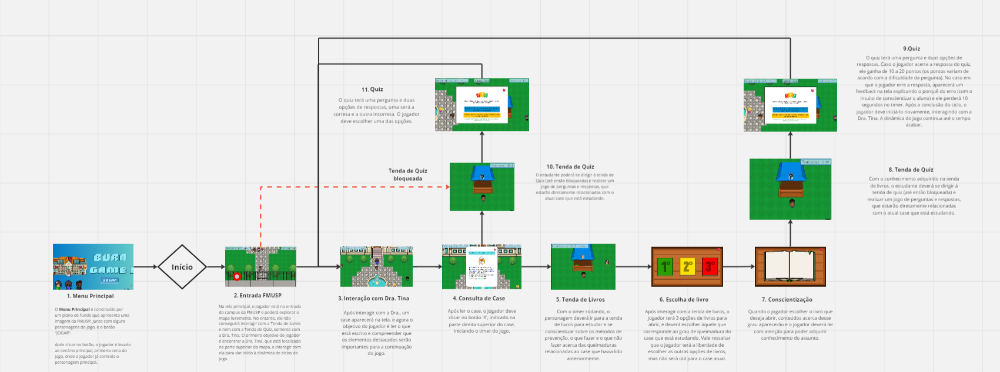

<sup>Fonte: Material produzido pelos autores (2024)</sup>

</div>

&nbsp;&nbsp;&nbsp;&nbsp;1 - Ao abrir o menu e clicar no botão “JOGAR”, o jogo iniciará. A tela inicial do jogo se passa no campus da Faculdade de Medicida da USP (FMUSP), onde chegarão os alunos para participarem da dinâmica do jogo. Após clicar no botão, o jogador é levado ao cenário principal, primeira cena do jogo, onde o jogador já controla o personagem principal.

<div align="center">

<sub>Figura 10 - Menu do Jogo</sub>

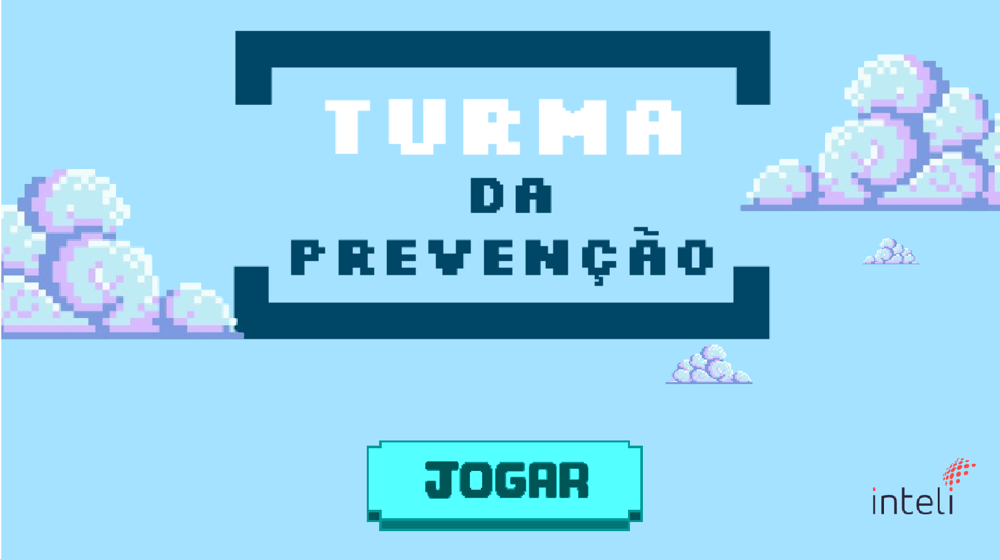

<sup>Fonte: Material produzido pelos autores (2024)</sup>

</div>

&nbsp;&nbsp;&nbsp;&nbsp;2 - Na tela principal, o jogador está na entrada do campus da FMUSP e poderá explorar o mapa livremente. No entanto, ele não conseguirá interagir com a Tenda de Livros e nem com a Tenda de Quiz, somente com a Dra. Tina. O primeiro objetivo do jogador é encontrar a Dra. Tina, que está localizada na parte superior do mapa, e interagir com ela para dar início à dinâmica de ciclos do jogo.

<div align="center">

<sub>Figura 11 - Campus FMUSP</sub>

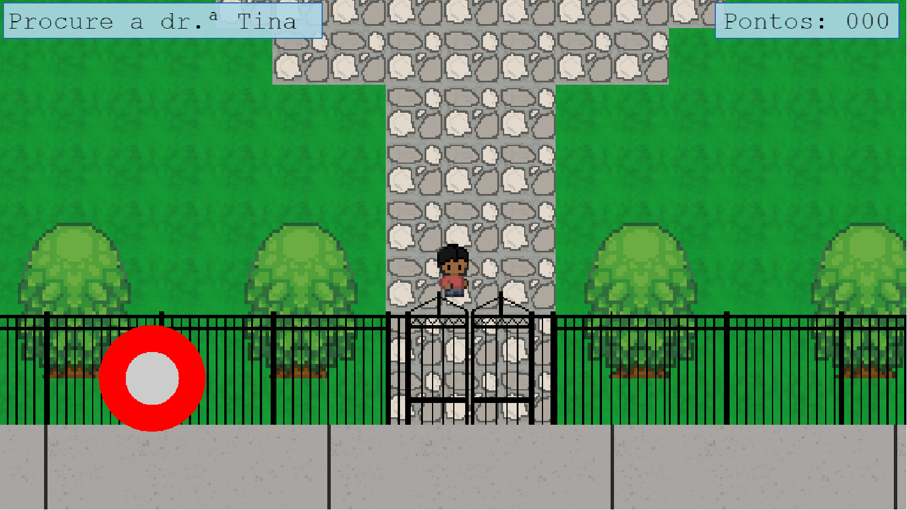

<sup>Fonte: Material produzido pelos autores (2024)</sup>

</div>

&nbsp;&nbsp;&nbsp;&nbsp;3 - Após interagir com a Dra., um case aparecerá na tela, e agora o objetivo do jogador é ler o que está escrito e compreender que os elementos destacados serão importantes para a continuação do jogo.

<div align="center">

<sub>Figura 12 - Encontro com Dra. Tina</sub>

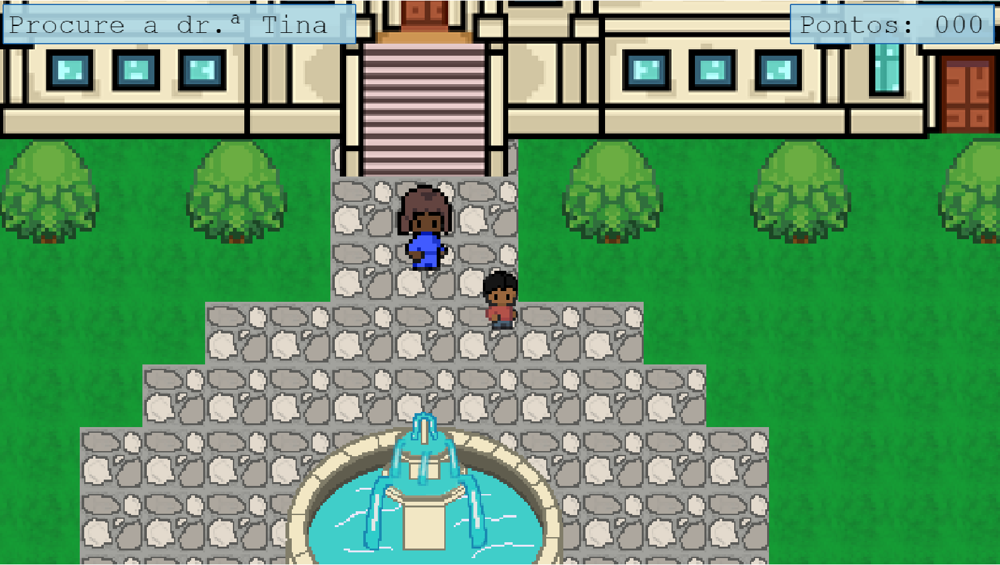

<sup>Fonte: Material produzido pelos autores (2024)</sup>

</div>

&nbsp;&nbsp;&nbsp;&nbsp;4 - Após ler o case, o jogador deve clicar no botão 'X', indicado na parte direita superior do case, iniciando o timer do jogo. 

<div align="center">

<sub>Figura 13 - Case</sub>

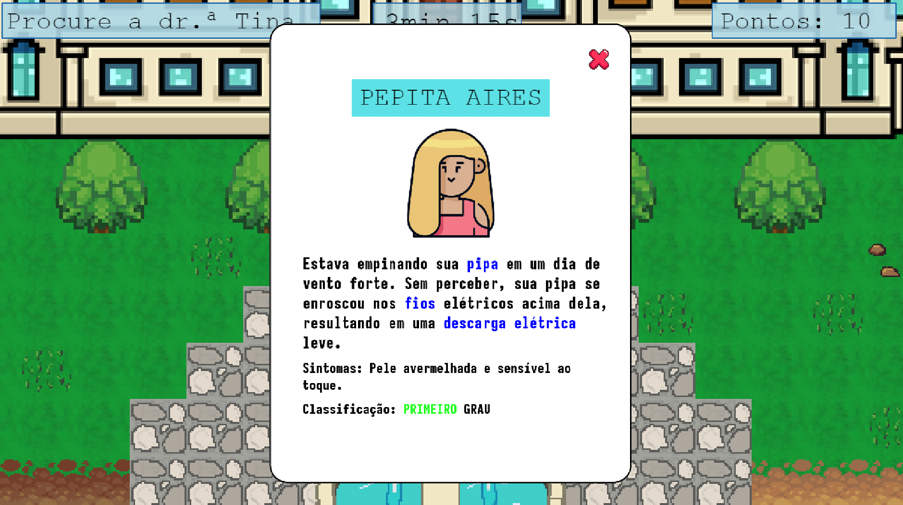

<sup>Fonte: Material produzido pelos autores (2024)</sup>

</div>

&nbsp;&nbsp;&nbsp;&nbsp;5 - Com o timer rodando, o personagem deverá ir para a tenda de livros para estudar e se conscientizar sobre os métodos de prevenção, o que fazer e o que não fazer acerca das queimaduras relacionadas ao case que havia lido anteriormente.


<div align="center">

<sub>Figura 14 - Tenda de Livros</sub>

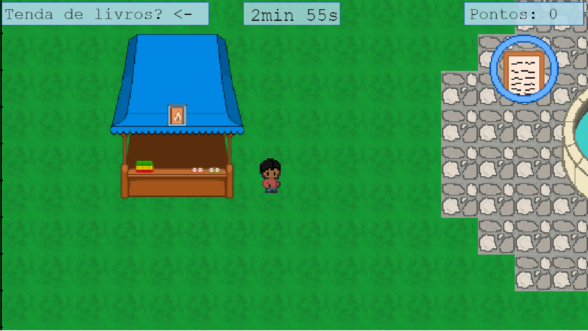

<sup>Fonte: Material produzido pelos autores (2024)</sup>

</div>

&nbsp;&nbsp;&nbsp;&nbsp;6 - Após interagir com a tenda de livros, o jogador terá 3 opções de livros para abrir, e deverá escolher àquele que corresponde ao grau de queimadura do case que está estudando. Vale ressaltar que o jogador terá a liberdade de escolher as outras opções de livros, mas não será útil para o case atual.

<div align="center">

<sub>Figura 15 - Livros</sub>

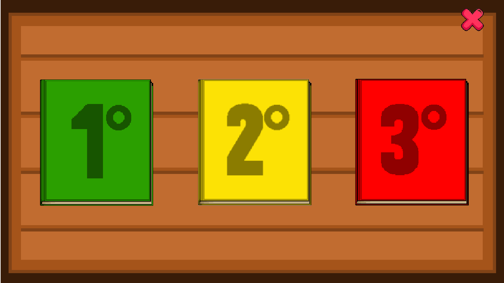

<sup>Fonte: Material produzido pelos autores (2024)</sup>

</div>

&nbsp;&nbsp;&nbsp;&nbsp;7 - Quando o jogador escolher o livro que deseja abrir, conteúdos acerca desse grau aparecerão e o jogador deverá ler com atenção para poder adquirir conhecimento do assunto.

<div align="center">

<sub>Figura 16 - Conteúdo do livro</sub>

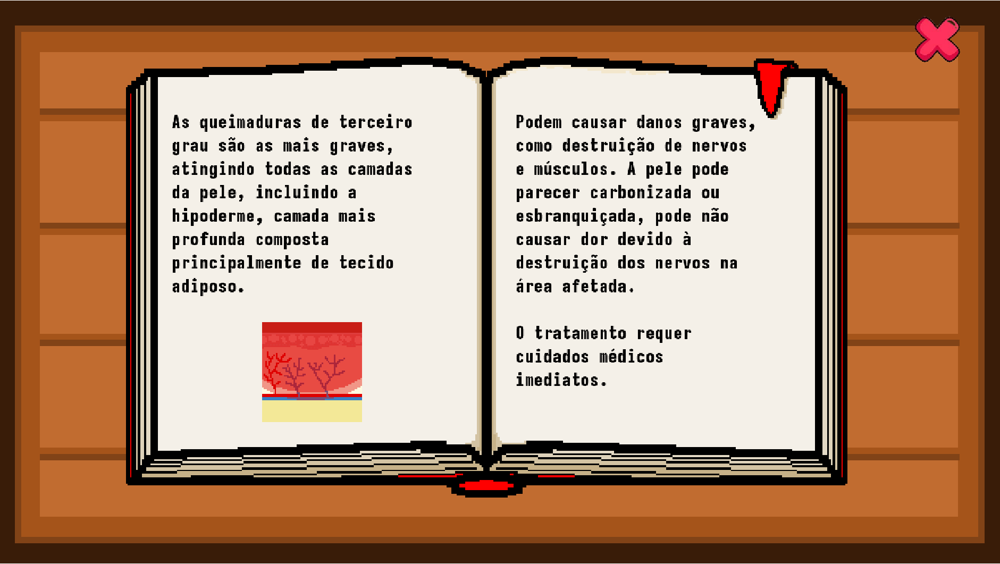

<sup>Fonte: Material produzido pelos autores (2024)</sup>

</div>

&nbsp;&nbsp;&nbsp;&nbsp;8 - Com o conhecimento adquirido na tenda de livros, o estudante deverá se dirigir à tenda de quiz (até então bloqueada) e realizar um jogo de perguntas e respostas, que estarão diretamente relacionadas com o atual case que está estudando.

<div align="center">

<sub>Figura 17 - Tenda de Quiz</sub>

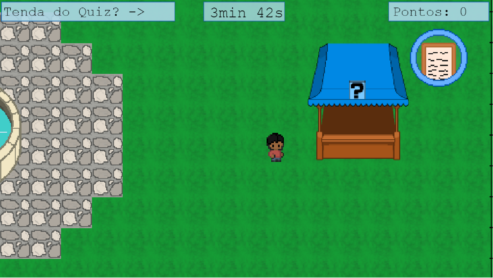

<sup>Fonte: Material produzido pelos autores (2024)</sup>

</div>

&nbsp;&nbsp;&nbsp;&nbsp;9 - O quiz terá uma pergunta e duas opções de respostas. Caso o jogador acerte a resposta do quiz, ele ganha de 10 a 20 pontos (os pontos variam de acordo com a dificuldade da pergunta). No caso em que o jogador erre a resposta, aparecerá um feedback na tela explicando o porquê do erro (com o intuito de conscientizar o aluno) e ele perderá 10 segundos no timer. Após a conclusão do ciclo, o jogador deve iniciá-lo novamente, interagindo com a Dra. Tina. A dinâmica do jogo continua até o tempo acabar. Fizz

<div align="center">

<sub>Figura 17 - Quiz</sub>

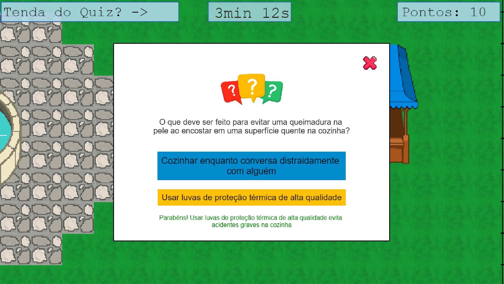

<sup>Fonte: Material produzido pelos autores (2024)</sup>

</div>

## 3.6. Regras do jogo

&nbsp;&nbsp;&nbsp;&nbsp;As regras de um jogo, segundo o livro “Regras do Jogo: Fundamentos do Design de Jogos (Volume 1)”, moldam a experiência do jogador, fornecem estrutura e significado, e promovem a interatividade ao definirem limites, objetivos e desafios. Com isso o jogador é, de certa forma, guiado a seguir a lógica (gameflow) própria daquele jogo.


&nbsp;&nbsp;&nbsp;&nbsp;Em nosso jogo, o personagem principal deve concluir o máximo de ciclos em um determinado tempo, obtendo assim uma pontuação que o jogador deve tentar superar a cada vez que jogar. Esses ciclos seguem uma lógica que consiste na apresentação do problema, auto estudo e teste do conhecimento adquirido; que ocorrerão, respectivamente, no encontro com a doutora Tina, na tenda de livros e na barraca do quiz. 


&nbsp;&nbsp;&nbsp;&nbsp;Ao interagir com a doutora, será apresentado ao jogador um caso de uma pessoa que sofreu uma queimadura. Após obter as informações do caso, o jogador deve se dirigir para a tenda de livros, onde irá ler sobre aquele caso para adquirir conhecimento e por fim colocará isso em prática no local do quiz, em que será feita uma pergunta e, com base nos acertos e no tempo que o jogador demorar em cada ciclo, obterá uma pontuação.

## 3.7. Mecânicas do jogo

&nbsp;&nbsp;&nbsp;&nbsp;O MDA, que foi apresentado pela primeira vez na  Conferência *Foundations of Digital Games* no artigo chamado *MDA: A Formal Approach to Game Design and Game Research*, é um *framework* desenvolvido por Robin Hunicke, Marc LeBlanc e Robert Zubek. Ele é muito utilizado no mundo do design de *games* para ajudar os produtores a criarem uma experiência imersiva e de altíssima qualidade para seu usuário. Isso é possível pela fragmentação do jogo em três aspectos: mecânica, dinâmica e estética. 

&nbsp;&nbsp;&nbsp;&nbsp;Segundo os desenvolvedores desse *framework*, as mecânicas são as várias ações, comportamentos e mecanismos de controle oferecidos ao jogador dentro de um contexto de jogo. Juntamente com o conteúdo do jogo (níveis, ativos e
assim por diante), a mecânica suporta a dinâmica geral da jogabilidade. Ou seja, as mecânicas compõem a parte mais fundamental do ponto de vista do desenvolvedor, pois são a base para a criação de dinâmicas, que, por sua vez, criam estéticas únicas, o que agrega valor ao produto desenvolvido.


&nbsp;&nbsp;&nbsp;&nbsp;Em nosso jogo as principais mecânicas são: tempo, limitadores de mapa, colisão com objetos, eventos ativados com colisão, resposta a questões objetivas, pontuação de acordo com velocidade e acertos, utilização das teclas WASD para movimentação do personagem no computador e joystick no celular. Essas mecânicas compõem a lógica fundamental de nosso jogo e fazem com que ele tenha uma dinâmica que coage o jogador a ter velocidade em sua ação e o guia a seguí-la.


# <a name="c4"></a>4. Desenvolvimento do Jogo

## 4.1. Desenvolvimento preliminar do jogo

&nbsp;&nbsp;&nbsp;&nbsp;A primeira versão do jogo possui duas cenas, uma de início e uma de jogo. Ambas possuem arte gráfica provisória e foram desenvolvidas com o intuito de serem apresentadas na reunião com o parceiro ao final do Sprint 1.

<div align="center">

<sub>Figura 18 - Cenas de jogo</sub>

<p align="middle">
    
    
</p>
<sup>Fonte: Material produzido pelos autores (2024)</sup>

</div>

&nbsp;&nbsp;&nbsp;&nbsp;A cena de início é uma artimanha de programação e será transformada futuramente em um arquivo JavaScript separado ao adquirirmos o conhecimento para tal. De momento, criamos duas imagens, um layer a frente das outras, e as removemos por um evento acionado pelo clique do mouse no botão “Jogar”.

<div align="center">

<sub>Figura 19 - Cena de início</sub>

<p align="middle">
    
    
</p>
<sup>Fonte: Material produzido pelos autores (2024)</sup>

</div>

&nbsp;&nbsp;&nbsp;&nbsp;A cena de jogo é composta por duas imagens também, uma simulando o cenário do jogo e outra, o personagem jogável, uma figura de médico. O personagem possui movimento direcional controlado pelas teclas WASD, como será exposto abaixo. Adaptações para os _inputs_ estão listados abaixo.

<div align="center">

<sub>Figura 20 - Cena de jogo</sub>

<p align="middle">
    
    
</p>
<sup>Fonte: Material produzido pelos autores (2024)</sup>

</div>

&nbsp;&nbsp;&nbsp;&nbsp;Para iniciar a explicação do código, dentro do arquivo `“cena1.js”`, carregamos as imagens na função `preload()` e as criamos na função `create()`, como mostrado a seguir.

```js
function preload() {
    // Carregamento de imagens
    this.load.image('cenaHospital', 'assets/cenaHospital.png'); // Fundo da cena do Hospital
    this.load.image('cenaMainMenu', 'assets/cenaMainMenu.png'); // Fundo da cena do Main Menu
    this.load.image('botaoJogar', 'assets/botaoJogar.png');     // Imagem para botaoJogar
    this.load.image('medico', 'assets/medico.png');             // Imagem para medico
    }
```
```js
function create () {
    // Carrega a cena Main Menu
    mainMenu = this.add.image(667, 362, 'cenaMainMenu').setDepth(2).setScale(1.005);    // setDepth -> Muda profundidade para frente
    botaoJogar = this.add.image(830, 575, 'botaoJogar').setInteractive().setDepth(2);
```
```js
    // Cena Hospital
    this.add.image(667, 362, 'cenaHospital');       // Cria e posiciona o Fundo
    medico = this.add.image(400, 300, 'medico');    // Cria e posiciona o Medico
    medico.setFlip(true, false);                    // Ajusta a orientação do Medico
```
&nbsp;&nbsp;&nbsp;&nbsp;Após o carregamento das imagens da cena do menu, configuramos uma série de eventos que ajustam o comportamento da imagem da setinha ao passar sobre o botão "Jogar" e o que ocorre ao clicá-lo.
```js
// Ajuste visual da imagem do mouse para fornecer feedback que o botão jogar é interativo
    botaoJogar.on("pointerover", () => {        // Evento de passar o mouse sobre o botaoJogar
        this.input.setDefaultCursor("pointer"); // Cursor vira mãozinha
    });
    botaoJogar.on("pointerout", () => {         // Evento de retirar o mouse do botaoJogar
        this.input.setDefaultCursor("default"); // Cursor vira setinha
    });

    // Evento disparado ao clicar no botão (Código temporário apenas para demonstração da funcionalidade na sprint 1)
    botaoJogar.on("pointerdown", () => {        // Evento de click do mouse
        mainMenu.destroy();                     // Remoção da imagem mainMenu da tela
        botaoJogar.destroy();                   // Remoção da imagem botaoJogar da tela
        this.input.setDefaultCursor("default"); // Retorno do cursor do mouse para setinha
    });
```
&nbsp;&nbsp;&nbsp;&nbsp;Após o clique do botão jogar e remoção dos elementos da cena inicial, foram implementados os controles básicos de movimento para o personagem utilizando as teclas WASD do teclado. O código da movimentação começou com a definição de um objeto para cada tecla na função `create()`. Por exemplo, o objeto `keyA` recebeu o _input_ da tecla “A” do teclado, como visto abaixo. 
```js
    // Inicializa as variáveis para movimentação do personagem
    keyA = this.input.keyboard.addKey(Phaser.Input.Keyboard.KeyCodes.A); 
    keyW = this.input.keyboard.addKey(Phaser.Input.Keyboard.KeyCodes.W); // O código de cada tecla e o modo pelo qual devemos "chamá-la"
    keyS = this.input.keyboard.addKey(Phaser.Input.Keyboard.KeyCodes.S); // encontram-se na linha 115000 do arquivo "phaser.js"
    keyD = this.input.keyboard.addKey(Phaser.Input.Keyboard.KeyCodes.D);
```
&nbsp;&nbsp;&nbsp;&nbsp;Posteriormente, na função `update()`, implementamos uma lógica para atualizar a posição do médico um número de _pixels_ ao acionar cada tecla individualmente. Foi criada uma variável chamada `pixelMove` do tipo _const_ para ajustar um número fixo de _pixels_ que a figura do médico deve mover ao receber o _input_ de cada tecla. Um detalhe adicional é a mudança de orientação da figura do personagem ao acionar as teclas de movimentação do eixo horizontal, teclas “A” e “D”. Vale ressaltar que, por conta de utilizarmos apenas o condicional `if` na notação do _“if/else”_, ela torna-se inclusiva, ou seja, é possível clicar em mais de uma tecla ao mesmo tempo, possibilitando o movimento diagonal.
```js
    // Mapeamento de Inputs (Normalizar o movimento diagonal futuramente)
    if (keyA.isDown) {
        medico.x -= pixelMove;
        medico.setFlip(true, false); // Ajusta orientação do personagem
    }
    if (keyD.isDown) {
        medico.x += pixelMove;
        medico.setFlip(false, false); // Ajusta orientação do personagem
    }   
    if (keyS.isDown) {
        medico.y += pixelMove;
    } 
    if (keyW.isDown) {
        medico.y -= pixelMove;
    }
```
&nbsp;&nbsp;&nbsp;&nbsp;Como o personagem não possui física ou colisão, é possível movimentá-lo para fora da cena do hospital. Com o intuito de evitar esse comportamento, foi implementado provisoriamente o código a seguir que reposiciona-o de volta à cena sempre que atingir uma borda.
```js
    // Reposiciona o objeto medico de volta ao mapa (Temporário antes de implementar colisão)
    if (medico.x > config.width) {
        medico.x = 20;
    }
    if (medico.x < 0) {
        medico.x = config.width - 20;
    }
    if (medico.y > config.height) {
        medico.y = 20;
    }
    if (medico.y < 0) {
        medico.y = config.height - 20;
    }
```
&nbsp;&nbsp;&nbsp;&nbsp;O final do código apresenta uma lógica inicial e experimental de tentativa de implementação de _inputs_ _mobile_. Mais estudo e pesquisa são necessários para refinar seu entendimento e comportamento.
Por fim, a variável `config` criada no início do código guarda todas as configurações necessárias para criar o objeto `Phaser.Game`. Dentre elas, podemos destacar que o tamanho da tela foi temporariamente fixado em 1334x725 _pixels_ e a propriedade `scale` foi definido como "FIT" para ajustar o tamanho da tela automaticamente, como podemos ver abaixo.
```js
// Cria as configurações para Phaser.Game
var config = {
    type: Phaser.AUTO,      // Ajusta o renderizador automaticamente (WebGL e Canvas)
    width: 1334,            // Ajusta a largura para 1334 pixels (temporário)
    height: 725,            // Ajusta a altura
    scale: {
        mode: Phaser.Scale.FIT, // Ajusta a tela para mobile
    },
    scene: { // Funções da cena
        preload: preload,   // Carrega os assets
        create: create,     // Cria os objetos e inicializa algumas configurações
        update: update      // Atualiza a lógica do jogo
    }
};
```
**Dificuldades**
- Tentar ajustar o tamanho da tela automaticamente para diferentes dispositivos;
- Definir corretamente os inputs de movimentação( demora para achar a sintaxe correta);
- Adaptação às boas práticas ao escrever código em Javascript.

**Próximos passos**
- Adaptar os inputs de movimentação para funcionarem com as setas do teclado e com o touch screen de dispositivos mobile;
- Normalizar a velocidade do deslocamento do objeto médico na direção diagonal;
- Mudar a arte gráfica para a definida pelo grupo de Design;
- Transformar a cena inicial de menu para um arquivo separado;
- Implementar mudança de cenas;
- Adicionar um objeto médico com animação (spritesheet);
- Adicionar lógica de colisão ao personagem para interação com outros objetos ou NPCs;
- Começar a implementação do quiz ao acessar a Farmácia (vide abaixo).

<div align="center">

<sub>Figura 21 - Protótipo do Quiz</sub>


<sup>Fonte: Material produzido pelos autores (2024)</sup>

</div>

## 4.2. Desenvolvimento básico do jogo

&nbsp;&nbsp;&nbsp;&nbsp;Na primeira sprint, o desenvolvimento foi focado em criar apenas um esboço do jogo. Em outras palavras, uma parte significativa do código foi refatorada à medida que os conteúdos eram apresentados ao longo da sprint.

&nbsp;&nbsp;&nbsp;&nbsp;Desse modo, a decisão foi: dividir a programação em pequenas etapas, que são: refatorar o jogo para incluir múltiplas cenas, implementar o novo menu em *pixel art*, adicionar físicas e colisões, integrar a câmera ao cenário e criar o novo cenário em *pixel art* usando o Tiled Map Editor.

**Etapa 1 do desenvolvimento - Refatorando o jogo em múltiplas cenas**

&nbsp;&nbsp;&nbsp;&nbsp;Na primeira entrega, o jogo apresentava um menu e a cena do médico no hospital. Ambos estavam incluídos no mesmo arquivo, sem qualquer separação entre as cenas. Como resultado, a imagem do menu era renderizada em primeiro plano, e ao clicar no botão de jogar, essa imagem era destruída.

&nbsp;&nbsp;&nbsp;&nbsp;Para aprimorar a arquitetura do jogo, essa abordagem foi refatorada para utilizar duas cenas distintas. Dessa maneira, o código foi dividido em três arquivos: `"main.js"`, `"menu.js"` e `"hospital.js"`. Cada arquivo é importado dentro da tag `<body>` do HTML, proporcionando uma estrutura mais organizada e modular.
```html
    <script src="scenes/menu.js"></script>
    <script src="scenes/hospital.js"></script>
    <script src="main.js"></script>
```
&nbsp;&nbsp;&nbsp;&nbsp;Vale ressaltar que essa ordem é importante, visto que, as duas classes contidas nos arquivos `"menu.js"` e `"hospital.js"` precisam estar declaradas para que o arquivo `"main.js"` possa ter acesso.

&nbsp;&nbsp;&nbsp;&nbsp;No arquivo `"main.js"`, está contida as configurações do phaser e a instância do objeto do jogo
```js
// Cria as configurações para Phaser.Game
const config = {
    type: Phaser.AUTO, // Ajusta o renderizador automaticamente (WebGL e Canvas)
    width: gameDimensions.width,  // Ajusta a largura para 1334 pixels (temporário)
    height: gameDimensions.height, // Ajusta a altura
    autoCenter: Phaser.Scale.CENTER_BOTH,
    physics: {
        default: 'arcade',
        arcade: {
            gravity: { y: 0 },
            debug: true
        }
    },
    scale: {
        mode: Phaser.Scale.FIT, // Ajusta a tela para mobile
    },
    scene: [
        MenuPrincipal, CenaHospital
    ]
};

// Cria o jogo passando a variável config como construtor para a classe
const game = new Phaser.Game(config);
```
&nbsp;&nbsp;&nbsp;&nbsp;Observe que no atributo `scene`, é passado um array com as classes das duas cenas, as quais serão controladas pelo Phaser.

&nbsp;&nbsp;&nbsp;&nbsp;Nos outros arquivos, `"hospital.js"` e `"menu.js"`, são criadas duas classes que herdam da classe `Phaser.Scene`. Ainda assim, essas classes mantêm a estrutura básica do Phaser, incluindo as funções `preload()`, `create()` e `update()` como métodos agora.
```js
class CenaHospital extends Phaser.Scene {
    preload(){}
    create(){}
    update(){}
}
```
&nbsp;&nbsp;&nbsp;&nbsp;O mesmo exemplo é aplicável ao menu.

&nbsp;&nbsp;&nbsp;&nbsp;Para finalizar, o código das respectivas cenas e funções foram transferidas para os arquivos em classe, colocando o operador `this` antes das variáveis por conta da mudança para classe.

**Etapa 2 do desenvolvimento - Novo menu em *pixel art***

&nbsp;&nbsp;&nbsp;&nbsp;O primeiro passo foi fazer o desenho do novo menu, com uma cara parecida, porém em *pixel art* feita no Piskel.

<div align="center">

<sub>Figura 22 - Novo menu desenvolvido no Piskel</sub>


<sup>Fonte: Material produzido pelos autores (2024)</sup>

</div>

<div align="center">

<sub>Figura 23 - Spritesheet do botão para animação</sub>


<sup>Fonte: Material produzido pelos autores (2024)</sup>

</div>

&nbsp;&nbsp;&nbsp;&nbsp;Após o design desenvolvido, o próximo passo foi implementar no Phaser
no método `preload()`: 
```js
preload(){
    this.load.image("background", "assets/background.png") // Fundo da cena do Main Menu
    this.load.spritesheet("botaoJogar", "assets/button.png", { frameWidth: 138, frameHeight: 46 }) // Imagem para botaoJogar
}
``` 
&nbsp;&nbsp;&nbsp;&nbsp;Em seguida, o menu foi implementado da mesma forma que no desenvolvimento preliminar. A única alteração foi no *click* do botão que, ao invés de destruir as imagens, troca a cena da seguinte forma:
````js
this.botaoJogar.on("pointerdown", () => {
    // Evento de click do mouse
    this.scene.start("hospital")
    this.scene.stop('menu')
    this.input.setDefaultCursor("default") // Retorno do cursor do mouse para setinha
})
````
&nbsp;&nbsp;&nbsp;&nbsp;No `this.scene.start` o Phaser inicia a cena do hospital e na linha seguinte encerra o menu.

**Etapa 3 do desenvolvimento - Implementação da física**

&nbsp;&nbsp;&nbsp;&nbsp;O primeiro passo foi habilitar a física na configuração do jogo:
```js
// Cria as configurações para Phaser.Game
const config = {
    physics: {
        default: 'arcade',
        arcade: {
            gravity: { y: 0 },
            debug: true
        }
    }
};
```
&nbsp;&nbsp;&nbsp;&nbsp;Colocando esse trecho de código, habilitamos a física no jogo, sem gravidade pois o nosso jogo é no estilo *top down*: vista de cima para baixo.

**Etapa 4 do desenvolvimento - Câmeras e cenário do Tiled Map Editor**

&nbsp;&nbsp;&nbsp;&nbsp;Nesta etapa, foi realizado a implementação do Mapa através de um arquivo JSON, localizado em `"src/assets/tilemaps/main_map.json"`. Este arquivo é exportado do Tiled Map Editor, que é um editor de mapas em blocos e por camadas

<div align="center">

<sub>Figura 24 - Mapa no Tiled Map Editor</sub>


<sup>Fonte: Material produzido pelos autores (2024)</sup>

</div>

&nbsp;&nbsp;&nbsp;&nbsp;Após isso, foi preciso importar o JSON para a classe `CenaHospital` e definir as camadas presentes nele que, nessa figura, são as paredes e o chão.

```js
preload(){
    this.load.image("medico", "assets/medico.png"); // Imagem para medico

    this.load.image('parede', 'assets/tilemaps/parede.png'); // Paredes do Mapa
    this.load.image('piso-atendimento', 'assets/tilemaps/piso-atendimento.png'); // Piso do mapa
    this.load.image('piso-corredor', 'assets/tilemaps/piso-corredor.png'); // Piso do corredor do Mapa
    this.load.image('piso-madeira', 'assets/tilemaps/piso-madeira.png'); // Piso da biblioteca do Mapa

    this.load.tilemapTiledJSON('mapa', 'assets/tilemaps/main_map.json'); //Carrega o tiled do mapa
}
create(){
    this.map = this.make.tilemap({ key: "mapa", tileWidth: 32, tileHeight: 32}); //Cria o mapa colocando o tamanho de cada "azulejo", que no nosso tiled foi 32x32
    this.tileset1 = this.map.addTilesetImage('parede'); //Adiciona no map um tileset e armazena ela
    this.tileset2 = this.map.addTilesetImage('piso-atendimento'); //Adiciona no map um tileset e armazena ela
    this.tileset3 = this.map.addTilesetImage('piso-corredor'); //Adiciona no map um tileset e armazena ela
    this.tileset4 = this.map.addTilesetImage('piso-madeira'); //Adiciona no map um tileset e armazena ela

    this.groundLayer = this.map.createLayer("Ground", [this.tileset2,this.tileset3,this.tileset4]); //Cria a camada do chão, passando o tileset e o nome que definimos no tiled map editor
    this.wallsLayer = this.map.createLayer("Walls", [this.tileset1], 0 , 0); //Cria a camada de paredes, passando o tileset e o nome que definimos no tiled map editor
}
```
&nbsp;&nbsp;&nbsp;&nbsp;Dessa forma, o mapa é carregado e aparece corretamente na tela. No entanto, o mapa é muito grande e para melhorar a jogabilidade foi preciso implementar a câmera. Dentro da função `create()`, foram atribuídos duas coisas na câmera: o *zoom* e a perseguição dela ao jogador.
````js
this.cameras.main.startFollow(this.medico, true); //camera inicia o follow no personagem principal
this.cameras.main.setZoom(2);
````
<div align="center">

<sub>Figura 25 - Mapa implementado no phaser com câmera</sub>


<sup>Fonte: Material produzido pelos autores (2024)</sup>

</div>

**Etapa 5 do desenvolvimento - Colisões com as paredes**

&nbsp;&nbsp;&nbsp;&nbsp;De início, foi preciso fazer algumas alterações no Tiled Map Editor, precisamos atribuir a todos os blocos que têm colisão uma propriedade personalizada que chamamos de `Collider`. Essa propriedade precisa ser do tipo `boolean` (verdadeiro ou falso). Com essa propriedade definida nos blocos, foi o momento de implementar a colisão. E com apenas duas linhas, graças ao Tiled Map Editor e às suas facilidades, foi possível definir colisão entre as paredes e o jogador.

````js
this.wallsLayer.setCollisionByProperty({ collider: true }) //Seta as colisões onde tem a propriedade collider: true no tiled map
this.physics.add.collider(this.medico, this.wallsLayer, () => console.log("Colidiu")) //Adiciona colisão entre o médico e a camada de parede
````
&nbsp;&nbsp;&nbsp;&nbsp;A primeira linha indica que a camada da parede terá colisão com os blocos que foram definidos com a propriedade `Collider` como verdadeira. Na segunda linha, adicionamos a colisão entre o médico e a parede, retornando um `console.log()` para indicar que houve a colisão.

&nbsp;&nbsp;&nbsp;&nbsp;Para que a colisão funcione como deveria, foi necessário alterar o modo de movimentação do personagem. Ao invés de movimentar o X e Y do personagem diretamente, foi preciso configurar uma velocidade para o personagem. Dessa forma, o Phaser consegue ter controle sobre todas as colisões. Essa modificação foi implementada utilizando o seguinte método dentro do bloco `update()` (considerando que a verificação WASD já foi implementada no desenvolvimento básico do jogo):
````js
this.medico.setVelocityX(velocidadeEmX)
this.medico.setVelocityY(velocidadeEmY)
````
<div align="center">

<sub>Figura 26 - Colisão entre o personagem e a parede</sub>


<sup>Fonte: Material produzido pelos autores (2024)</sup>

</div>

**Etapa 6 do desenvolvimento - Implementação do joystick e tela cheia**

&nbsp;&nbsp;&nbsp;&nbsp;No projeto foi utilizada uma biblioteca chamada *Rex Virtual Joystick*, que está localizada em `src/plugins/rexvirtualjoystickplugin.min.js` sendo importada na cena do hospital na função `preload()`.
````js
this.load.plugin("rexvirtualjoystickplugin","/src/plugins/rexvirtualjoystickplugin.min.js",true); //Carrega a biblioteca do joystick
````
&nbsp;&nbsp;&nbsp;&nbsp;O joystick também tem um objeto `config`, em que são definidos certos parâmetos, como as posições x e y, o raio do objeto e os objetos dentro do phaser que representarão os joysticks. Além disso, define qual a cena que está sendo utilizada, no nosso caso a `CenaHospital`. Ademais, uma função no joystick é chamada `scrollFactor(0)` que define que o joystick mova junto com a câmera
````js
this.joystick = this.plugins.get("rexvirtualjoystickplugin").add(
      this,
      {
        x: 490,
        y: this.medico.y + 125,
        radius: 30,
        base: this.add.circle(0, 0, 30, 0xff0000),
        thumb: this.add.circle(0, 0, 15, 0xcccccc),
        minForce: 2,
      }
);
this.joystick.setScrollFactor(0); // Faz com que o joystick não se mova com a câmera
````
&nbsp;&nbsp;&nbsp;&nbsp;Na biblioteca do joystick, dois atributos são retornados: o `angle` e o `force`. Esse atributos estão sendo utilizados para a movimentação vetorial. O cálculo foi feito usando a decomposição vetorial, da seguinte forma:

<div align="center">

<sub>Figura 27 - Cálculo da velocidade em X e Y</sub>


<sup>Fonte: Material produzido pelos autores (2024)</sup>

</div>

&nbsp;&nbsp;&nbsp;&nbsp;Os vetores da velocidade do personagem são decompostos, o que faz com que ele, além de não andar mais rápido na diagonal, siga o ângulo que o usuário coloca no joystick virtual.

&nbsp;&nbsp;&nbsp;&nbsp;A biblioteca, no atributo `angle` retorna um ângulo entre 0 e -180 graus no primeiro e no segundo quadrante do círculo trigonométrico e de 180 até 0 graus no terceiro e no quarto quadrante do círculo, tudo isso foi verificado com `console.log()`. Para resolver esse problema a função `fixAngle()` é chamada, ela faz com que o ângulo do joystick vá de 0 a 360 graus no sentido anti-horário.
````js
fixAngle(angle) {
    if (angle < 0) {
      return -angle
    }
    else if (angle > 0) {
      return 360 - angle
    }
}
````
&nbsp;&nbsp;&nbsp;&nbsp;Após isso, um tratamento é feito para converter o ângulo, que antes estava graus, para radianos, pois o cálculo de seno e cosseno no javascript precisa ser feito em radianos. `this.radiansAngleJoystick = this.fixAngle(this.joystick.angle)*Math.PI/180 || 0;`.

&nbsp;&nbsp;&nbsp;&nbsp;Por fim, define-se uma força máxima para o jogador não ficar muito rápido, visto que a força do joystick não define limite para ela, ou seja, a força seria equivalente ao quanto o dedo é arrastado na tela e poderia ser muito grande se a tela fosse grande. Ficando da seguinte forma: `this.joystickForce = this.joystick.force < 75 ? this.joystick.force : 75;`

&nbsp;&nbsp;&nbsp;&nbsp;Passando para as contas para o javascript:
````js
const velocityDoctorX = (this.defaultVelocity * Math.cos(this.radiansAngleJoystick) * this.joystickForce)
velocityDoctorX < 0 ? this.medico.setFlip(false, false) : this.medico.setFlip(true, false)
const velocityDoctorY = -(this.defaultVelocity * Math.sin(this.radiansAngleJoystick) * this.joystickForce)
````
&nbsp;&nbsp;&nbsp;&nbsp;Após isso, basta implementar a velocidade do personagem para que a movimentação vetorial funcione.

<div align="center">

<sub>Figura 28 - Movimentação vetorial com o controle joystick</sub>


<sup>Fonte: Material produzido pelos autores (2024)</sup>

</div>

&nbsp;&nbsp;&nbsp;&nbsp;Para a tela cheia, quando o jogador clica no botão 'jogar' uma função que acessa o elemento principal do HTML e deixa ele em tela cheia.
````js
openFullScreen() {
    const page = document.documentElement //Pega o documento inteiro
    if (page.requestFullscreen){ //Se o navegador suportar o Fullscreen
        page.requestFullscreen() //Ativa o Fullscreen
    } else if (page.mozRequestFullScreen){ //Se o navegador suportar o Fullscreen do Mozila
        page.mozRequestFullScreen() //Ativa o Fullscreen
    } else if (page.webkitRequestFullscreen){ //Se o navegador suportar o Fullscreen do Webkit
        page.webkitRequestFullscreen() //Ativa o Fullscreen
    } else if (page.msRequestFullscreen){ //Se o navegador suportar o Fullscreen do Microsoft
        page.msRequestFullscreen() //Ativa o Fullscreen
    }
}
````
&nbsp;&nbsp;&nbsp;&nbsp;Esse método deixa a página em tela cheia, assim que o botão de jogar é clicado.

<div align="center">

<sub>Figura 29 - Joystick no jogo e tela cheia</sub>


<sup>Fonte: Material produzido pelos autores (2024)</sup>

</div>

**Dificuldades**
- Implementação da colisão;
- Dificuldade em ajustar o Tile Map;
- Implementar as entradas Mobile - O jogo já tem uma biblioteca para um joystick e teve dificuldade quanto a responsividade.

**Próximos passos**
- Terminar toda a decoração do mapa;
- Implementar o quiz e a lógica da biblioteca;
- Implementar a movimentação através de vetores;
- Spritesheet do personagem animada e finalizada;
- Sritesheet dos NPC's para animar no jogo.

## 4.3. Desenvolvimento intermediário do jogo

&nbsp;&nbsp;&nbsp;&nbsp;Na terceira sprint, o foco da codificação foi reformular a dinâmica do jogo para se adaptar ao novo design de cenário requisitado pelo cliente. Além disso, aprofundamos o desenvolvimento para o nível intermediário do projeto, ou seja, foram implementados estruturas lógicas para a demonstração de, pelo menos, um ciclo do jogo.

&nbsp;&nbsp;&nbsp;&nbsp;A organização dessa sprint, assim como a da sprint passada, foi dividir as tarefas de programação em pequenas etapas, fragmentando o que era necessário e distribuindo para diferentes pessoas. Isso foi feito com o intuito de evitar sobrecarga dos membros da equipe e impulsionar o aprendizado, pois aqueles que não têm afinidade com programação foram os responsáveis pelo desenvolvimento nessas duas semanas.  

&nbsp;&nbsp;&nbsp;&nbsp;As estruturas implementadas no jogo foram os aprimoramentos dos overlaps e colisões, a criação de um novo cenário, a implementação do HUD, que inclui elementos como o timer, a pontuação e as missões a serem realizadas pelo personagem. As ferramentas utilizadas nessa sprint foram o Tiled Map Editor, para a criação do novo mapa; Piskel, para o design dos livros, quiz e personagens; e PixilArt para a elaboração do edifício da Faculdade de Medicina da USP.


**Etapa 1 do desenvolvimento - Criação do novo cenário**

&nbsp;&nbsp;&nbsp;&nbsp;Na sprint anterior, o jogo se passava em um ambiente hospitalar, onde o personagem principal era o médico residente. Com a mudança de cenário, o local passou a ser o pátio da FMUSP e os elementos do jogo foram adaptados para o novo espaço, como o menu, os personagens e os espaços de interação. O modo de uso do Tiled Map Editor para a criação do novo mapa foi o mesmo descrito no tópico 4.2. Fizz

<div align="center">

<sub>Figura 30 - Mapa</sub>


<sup>Fonte: Material produzido pelos autores (2024)</sup>

</div>


**Etapa 2 do desenvolvimento - Colisões e Overlaps**

&nbsp;&nbsp;&nbsp;&nbsp;Foram implementadas, inicialmente, as colisões necessárias para a dinâmica do jogo, configuradas no próprio Tiled Map Editor e adicionadas, com o auxílio de um documento .JSON e do framework Phaser, no código. Na implementação das colisões, utilizamos, dentro do `create()`, o método do Phaser `.setCollisionByProperty()`, que adiciona colisão entre objetos por meio das propriedades adicionadas a eles no Tiled Map Editor e, além disso, para obejtos circulares ou irregulares foi adicionada uma colisão especial em formato de círculo pela adição de um círculo com o método `this.add.circle()`, como descrito a seguir:

```js
	//configurando um colisor entre o jogador e os limites do mundo do jogo
    this.physics.add.collider(this.jogador, this.worldBounds);

    // Cria colisões com a fonte no mapa
    this.circuloFonte = this.add.circle(560, 570, 70, 0xffffff, 0); //Adiciona círculo sob a fonte
    this.physics.add.existing(this.circuloFonte); //Adiciona física ao círculo adicionado
    this.circuloFonte.body.setCircle(70).setImmovable(); //Define a hitbox do objeto criado como um círculo imóvel
    this.fonte.setCollisionByProperty({
      collider: false
    }) //Seta as colisões onde tem a propriedade collider: true no tiled map
    this.physics.add.collider(this.jogador, this.circuloFonte);


    // Cria colisão com as árvores
    this.arvores.setCollisionByProperty({
      collider: true
    }) //Seta as colisões onde tem a propriedade collider: true no tiled map
    this.physics.add.collider(this.jogador, this.arvores, () => console.log("Colidiu")) //Adiciona colisão entre o jogador e as árvores

    //Cria colisão com a tenda
    this.tendaQuiz.setCollisionByProperty({
      collider: true
    }) //Seta as colisões onde tem a propriedade collider: true no tiled map
    this.tendaLivro.setCollisionByProperty({
      collider: true
    }) //Seta as colisões onde tem a propriedade collider: true no tiled map

    // Cria colisão com a faculdade
    this.faculdade.setCollisionByProperty({
      collider: true
    }) //Seta as colisões onde tem a propriedade collider: true no tiled map
    this.physics.add.collider(this.jogador, this.faculdade, () => console.log("Colidiu"))


    // Cria colisão com a cerca
    this.cerca.setCollisionByProperty({
      collider: true
    }) //Seta as colisões onde tem a propriedade collider: true no tiled map
    this.physics.add.collider(this.jogador, this.cerca, () => console.log("Colidiu"))
```
     
&nbsp;&nbsp;&nbsp;&nbsp;Após a implementação das colisões, o próximo passo foi construir o *overlap* do aluno com a Tina no método `create()` e também desativá-lo assim que o aluno colidir com ela. Isso foi feito por meio dos métodos `this.physics.add.overlap ()` e `this.physics.world.removeCollider()`, respectivamente, como pode ser observado abaixo:

```js
	 this.tinaCollider = this.physics.add.overlap(this.tina, this.jogador, () => { // Cria o overlap entre o jogador principal e a Tina
      console.log('teste'); // Console log para verificar o funcionamento do overlap
      this.physics.pause()
      this.case1.setVisible(true)
      this.botaoX.setVisible(true)

      this.botaoX.on("pointerover", () => {
        // Evento de passar o mouse sobre o botaoJogar
        this.input.setDefaultCursor("pointer") // Cursor vira mãozinha
      });
      this.botaoX.on("pointerout", () => {
        // Evento de retirar o mouse do botaoJogar
        this.input.setDefaultCursor("default") // Cursor vira setinha
      });

      // Evento disparado ao clicar no botão (Código temporário apenas para demonstração da funcionalidade na sprint 1)
      this.botaoX.on("pointerdown", () => {
        this.physics.resume()

        this.case1.setVisible(false);
        this.botaoX.setVisible(false);

        //  Dispatch a Scene event
        this.events.emit('showTimer');
        this.events.emit('botaoCase');
        this.musicaIntroducao.stop(); // Para a música de introdução
        this.musicaJogo.play(); // Inicia a música de jogo

      }, this.physics.world.removeCollider(this.tinaCollider));
    });

```
&nbsp;&nbsp;&nbsp;&nbsp;Dentro dessa função, a física do jogo é pausada e o 'case' - onde contém o caso atual - é mostrado com as informações, que serão necessárias para estudar e responder o quiz. Nessa função de collider, alguns eventos são emitidos, eles foram utilizados para implementar o HUD posteriormente.
&nbsp;&nbsp;&nbsp;&nbsp;Avançando para o desenvolvimento da dinâmica de nosso jogo, adicionamos colisões entre as tendas de livros e quiz e o personagem principal.

**Tenda de Livros**

&nbsp;&nbsp;&nbsp;&nbsp;Para adicionarmos a colisão entre a tenda de livros e o personagem, foram adicionados `this.physics.add.collider` entre o jogador `this.jogador` e a tenda `this.tendaLivro` no método `create()` da `cenaPrincipal.js`. Uma função é definida logo após estabelecermos a colisão entre os elementos através de `() => {}`, retomando a cena dos livros `livros.js` através de `this.scene.wake('livros')` e pausando a física da cena atual com `this.physics.pause()`, como demonstrado abaixo:

``` js
this.physics.add.collider(this.jogador, this.tendaLivro, () => {
    console.log("Colidiu com a tenda do livro") //Adiciona colisão entre o jogador e a tenda de livros

    //chama a cena para mostrar os 3 livros
    this.scene.wake('livros');
    // pausa a física do jogo enquanto a cena livros estiver exposta
    this.physics.pause()
});

```

**Tenda de Quiz**

&nbsp;&nbsp;&nbsp;&nbsp;Similarmente, na tenda de quiz, a colisão com o personagem foi adicionada como anteriormente. Estabelecemos colisão entre o jogador `this.jogador` e a tenda de quiz `this.tendaQuiz`, também definindo uma função após este evento através de `() => {}`, retomando a cena de quiz `quiz.js` por `this.scene.wake('quiz')` e pausando a física da cena atual por `this.physics.pause()`.

&nbsp;&nbsp;&nbsp;&nbsp;O código descrito pode ser conferido abaixo:

``` js
this.physics.add.collider(this.jogador, this.tendaQuiz, () => {
    console.log("Colidiu com a tenda do quiz") //Adiciona colisão entre o jogador e a tenda

    //chama a cena para mostrar o quiz
    this.scene.wake('quiz');
    // pausa a física do jogo enquanto a cena do quiz estiver exposta
    this.physics.pause()
});
```

&nbsp;&nbsp;&nbsp;&nbsp;As cenas `livros.js` e `quiz.js` citadas acima serão abordadas na Etapa 6 do desenvolvimento - Tendas

**Etapa 3 do desenvolvimento - Implementação do HUD**

&nbsp;&nbsp;&nbsp;&nbsp;O HUD do jogo foi criado em uma nova cena situada na classe CenaHUD, contendo os seguintes elementos: timer, pontuação, botão de reabertura do case e um quadro de orientação das missões. A seguir é possível visualizar o modo como foi implementado:

```js
class CenaHUD extends Phaser.Scene
{
    constructor (){
        super({ key: 'cenaHUD', active: true}); // Define a key da cena e a mantém ativada desde o início do ciclo de jogo

        this.score = 0;
    }
    
    preload () {
        this.load.image('botaoCaseBaixo', 'assets/botaoCase_baixo.png');
        this.load.image('botaoCaseAlto', 'assets/botaoCase_alto.png');
    }

    create ()
    {
        this.tempoInicial = 300; // Define o tempo de um ciclo em segundos
        this.fundo = this.add.rectangle(635, 30, 210, 50, 0xadd8e6).setVisible(false).setAlpha(0.8); 
        this.textoTempo = this.add.text(545, 10,  (this.tempoInicial - this.tempoInicial %60)/60 + 'min ' + this.tempoInicial %60 + 's', { fontSize: '40px', fill: '#000000'}).setVisible(false); // Adiciona o texto do tempo na tela do jogo
        this.botaoCaseBaixo = this.add.image(100, 100, 'botaoCaseBaixo').setScale(3).setVisible(false).setInteractive(); // Adiciona o ícone do case abaixado
        this.botaoCaseAlto = this.add.image(100, 100, 'botaoCaseAlto').setScale(3).setVisible(false).setInteractive(); // Adiciona o ícone do case levantado
        this.botaoCase = this.add.circle(100, 100, 70, 0xffffff, 1).setVisible(false).setInteractive().setAlpha(0.1); // Adiciona um círculo para interação com os ícones

        //  Busca a cenaPrincipal como referência 
        const cenaAtual = this.scene.get('cenaPrincipal');

        //  Monitora eventos da cenaPrincipal
        cenaAtual.events.on('showTimer', function ()
        {
            // setTimeout( () => {
            // }, this.tempoInicial * 1000); // função para chamar tela final após o tempo de jogo (A SER IMPLEMENTADO)

            this.fundo.setVisible(true).setStrokeStyle(2, 0x1a65ac)

            this.textoTempo.setVisible(true)
            this.time.addEvent({ 
                delay: 1000, // delay de 1000 ms = 1 segundo
                callback: () => {
                    //   this.fundoTimer.setVisible(true);
                    this.textoTempo.setVisible(true);
                    if(this.tempoInicial >0) {
                        this.tempoInicial -= 1; // Decrementa o contador
                    }
                    this.textoTempo.setText((this.tempoInicial - this.tempoInicial %60)/60 + 'min ' + this.tempoInicial %60 + 's')
                    // console.log('time: ',time/1000)
                    if (this.tempoInicial == 99) {
                        //this.textoTempo.setPosition(this.player.x, 100);
                    };
                       
                    if ((this.tempoInicial - this.tempoInicial %60)/60 === 0 && this.tempoInicial <= 30) {
                        //this.textoTempo.setPosition(550, 400);
                        this.textoTempo.setColor('#ff0000');
                    };
                },
                loop: true // Atualiza o texto
              });
        }, this);

        cenaAtual.events.on('botaoCase', function () // Define o evento 'botaoCase'
        {
            this.botaoCase.setVisible(true);
            this.botaoCaseBaixo.setVisible(true);
            this.botaoCase.on("pointerover", () => { // Troca o ícone de reabertura do case quando o mouse está em cima
                this.botaoCaseBaixo.setVisible(false);
                this.botaoCaseAlto.setVisible(true);
            });

            this.botaoCaseBaixo.setVisible(true);
            console.log("teste1");
            this.botaoCase.on("pointerout", () => { // Retorna o ícone de reabertura do case quando o mouse está em cima
                this.botaoCaseBaixo.setVisible(true);
                this.botaoCaseAlto.setVisible(false);
            });

            this.botaoCase.on("pointerdown", () => { // Disparo da cena 'abrirCase' quando clicar no botão do case
                cenaAtual.physics.pause();
                this.events.emit('abrirCase');
                console.log("teste2");
            });
        }, this);
    }
}

```
&nbsp;&nbsp;&nbsp;&nbsp;Nessa parte, alguns elementos como retângulos e texto são adicionados. Os elementos são adicionados através de eventos, ou seja, na cena principal, quando o usuário clica no botão de fechar o evento é emitido pela cena principal e a cena do HUD ouve esse evento e cria/mostra os elementos. Como a cena fica sempre ativa os elementos são exibidos através do método `setVisible(boolean)`.

**Etapa 4 do desenvolvimento - Refatoramento do Código**

&nbsp;&nbsp;&nbsp;&nbsp;Para refatorar o código, alguns padrões foram adotados: nome de classe maiúscula, variáveis em 'camelCase' e procurar comentar o código de forma concisa, mas que seja legível.

**Etapa 5 do desenvolvimento - Implementação da Trilha e Efeitos Sonoros / Tela de loading**

&nbsp;&nbsp;&nbsp;&nbsp;Para implementar o som, primeiramente foi preciso escolher os sons. Para isso, foi baixados sons do site "FreeSound" com licenças Creative Commons. Os sons Creative Commons são importantes para evitar problemas com direitos autorais.
&nbsp;&nbsp;&nbsp;&nbsp;Após isso, o aúdio foi editado no software "Audacity", para que o som fique mais rápido nos segundos finais do jogo. Em seguida, os assets de som foram carregados no método `preload()`
````js
    this.load.audio('musicaIntroducao', 'assets/sounds/IntroMusic.wav') // Música de introdução
    this.load.audio('musicaJogo', 'assets/sounds/gameMusicLoopWithEndGame.mp3') // Música de jogo quando o 
````
&nbsp;&nbsp;&nbsp;&nbsp;Com essas alterações, o tempo de carregamento do jogo aumentou consideravelmente, por conta das músicas serem mais pesadas que as imagens. Para resolver isso, uma tela de carregamento foi implementada utilizando os eventos `this.load.on('progress', callback(value))` e `this.load.on('complete', callback(loadInfos))`. A função de 'callback' no progresso recebe como parâmetro um valor de 0 até 1, que, no nosso caso, foi multiplicado pela largura da barra de progresso para montar a animação. Já o evento 'complete' destrói os elementos da tela de carregamento.
````js
    this.boxBarraDeCarregamento = this.add.rectangle(240, 600, 800, 100, 0x000000, 0.8).setStrokeStyle(4, 0xFFFFFF).setOrigin(0, 0);
    this.barraCarregamento = this.add.rectangle(250, 610, 0, 80, 0xFFFFFF, 0.8).setOrigin(0, 0);
    this.carregandoTexto = this.add.text(240, 550, 'Carregando...', {
      fontSize: '40px',
      fill: '#FFFFFF'
    }).setOrigin(0, 0);
    this.load.on('complete', (params) => {
      this.boxBarraDeCarregamento.destroy();
      this.barraCarregamento.destroy();
      this.carregandoTexto.destroy();
    });
    this.load.on('progress', (value) => {
      this.barraCarregamento.width = 780 * value;
    });
````
&nbsp;&nbsp;&nbsp;&nbsp;Após isso, o jogo inicia com a música de introdução e quando o primeiro ciclo de jogo - após fechar o caso dado pela Dra. Tina - começa, a música de introdução é pausada e a música com mais batidas é iniciada.
````js
this.musicaIntroducao = this.sound.add('musicaIntroducao', {
    loop: true
}); // Adiciona a música de introdução
this.musicaJogo = this.sound.add('musicaJogo', {
    loop: false,
    volume: 0.5 //Volume ajustado porque essa música é mais alta
}); // Adiciona a música de jogo
this.musicaIntroducao.play(); // Inicia a música de introdução
````
&nbsp;&nbsp;&nbsp;&nbsp;Por fim, quando o caso é fechado a música atual é pausada e a nova música se inicia
````js
this.botaoX.on("pointerdown", () => {
    this.musicaIntroducao.stop(); // Para a música de introdução
    this.musicaJogo.play(); // Inicia a música de jogo

});
````
**Etapa 6 do desenvolvimento - Tendas**

&nbsp;&nbsp;&nbsp;&nbsp;Nesta sprint, adicionamos cenas `livros.js` e `quiz.js` para implementarmos as mecânicas necessárias para a dinâmica do jogo. Estas cenas são chamadas na `cenaPrincipal.js` com a interação do jogador com o ambiente.

&nbsp;&nbsp;&nbsp;&nbsp;Vejamos a implementação da cena `livros.js`, chamada quando o jogador entra em contato com a tenda de livros, a seguir: 

``` js
class Livros extends Phaser.Scene {
    constructor() {
        super({
            key: 'livros',
        })
    }

    preload() {
        // Carrega as imagens a serem utilizadas
        this.load.image('livroVerde', 'assets/livroVerde.png');
        this.load.image('livroAmarelo', 'assets/livroAmarelo.png');
        this.load.image('livroVermelho', 'assets/livroVermelho.png');
        this.load.image('livroVerdeAberto', 'assets/livroVerdeAberto.png');
        this.load.image('livroAmareloAberto', 'assets/livroAmareloAberto.png');
        this.load.image('livroVermelhoAberto', 'assets/livroVermelhoAberto.png');
        this.load.image('backgroundLivros', 'assets/backgroundLivros.png');
    }

    create() {
        // Adiciona o background e livros a serem apresentados na cena
        this.add.image(0, 0, 'backgroundLivros').setOrigin(0, 0).setScale(2);
        this.livroVerde = this.add.image(100, 200, 'livroVerde').setOrigin(0,0).setScale(1.6).setInteractive();
        this.livroAmarelo = this.add.image(500, 200, 'livroAmarelo').setOrigin(0,0).setScale(1.6).setInteractive();
        this.livroVermelho = this.add.image(900, 200, 'livroVermelho').setOrigin(0,0).setScale(1.6).setInteractive();

        this.livroVerde.on("pointerdown", () => { // Define função que chama o livro verde aberto quando clicar no livro verde fechado
            this.livroVerde.setVisible(false);
            this.livroAmarelo.setVisible(false);
            this.livroVermelho.setVisible(false);
            this.livroVerdeAberto = this.add.image(640, 350, 'livroVerdeAberto').setScale(2.6);
        });

        this.livroAmarelo.on("pointerdown", () => { // Define função que chama o livro amarelo aberto quando clicar no livro amarelo fechado
            this.livroVerde.setVisible(false);
            this.livroAmarelo.setVisible(false);
            this.livroVermelho.setVisible(false);
            this.livroAmareloAberto = this.add.image(640, 350, 'livroAmareloAberto').setScale(2.6);
        });

        this.livroVermelho.on("pointerdown", () => { // Define função que chama o livro vermelho aberto quando clicar no livro vermelho fechado
            this.livroVerde.setVisible(false);
            this.livroAmarelo.setVisible(false);
            this.livroVermelho.setVisible(false);
            this.livroVermelhoAberto = this.add.image(640, 350, 'livroVermelhoAberto').setScale(2.6);
        });
    }        
}
```
&nbsp;&nbsp;&nbsp;&nbsp;O código de cena se inicia com a criação de uma classe Livros e definição de sua key para referenciação:

``` js
class Livros extends Phaser.Scene {
    constructor() {
        super({
            key: 'livros',
        })
    }
}
```

&nbsp;&nbsp;&nbsp;&nbsp;Nesta cena, algumas imagens são utilizadas. Na função `preload()`, partimos para o carregamento das imagens de plano de fundo, livros fechados e livros abertos a serem utilizadas posteriormente. Na cena, 3 livros fechados são apresentados, um verde, um amarelo e um vermelho, carregados através de `this.load.image()` nas referências `livroVerde`, `livroAmarelo` e `livroVermelho`, respectivamente. Portanto, 3 imagens de livros abertos também são carregados, `livroVerdeAberto`, `livroAmareloAberto` e `livroVermelhoAberto` respeitando as cores dos livros incluídos até então. Segue o código de carregamento destes *assets*.

``` js
preload() {
        // Carrega as imagens a serem utilizadas
        this.load.image('livroVerde', 'assets/livroVerde.png');
        this.load.image('livroAmarelo', 'assets/livroAmarelo.png');
        this.load.image('livroVermelho', 'assets/livroVermelho.png');
        this.load.image('livroVerdeAberto', 'assets/livroVerdeAberto.png');
        this.load.image('livroAmareloAberto', 'assets/livroAmareloAberto.png');
        this.load.image('livroVermelhoAberto', 'assets/livroVermelhoAberto.png');
        this.load.image('backgroundLivros', 'assets/backgroundLivros.png');
    }
```

&nbsp;&nbsp;&nbsp;&nbsp;Com as imagens carregadas, seguimos para a implementação dessas imagens dentro do jogo através do método `this.add.image()` e os atribuindo às variáveis `livroVerde`, `livroAmarelo`, `livroVermelho`, responsáveis por segurar suas informações. Vemos como isso é feito abaixo:

``` js
create() {
            // Adiciona o background e livros a serem apresentados na cena
            this.add.image(0, 0, 'backgroundLivros').setOrigin(0, 0).setScale(2);
            this.livroVerde = this.add.image(100, 200, 'livroVerde').setOrigin(0,0).setScale(1.6).setInteractive();
            this.livroAmarelo = this.add.image(500, 200, 'livroAmarelo').setOrigin(0,0).setScale(1.6).setInteractive();
            this.livroVermelho = this.add.image(900, 200, 'livroVermelho').setOrigin(0,0).setScale(1.6).setInteractive();
```

&nbsp;&nbsp;&nbsp;&nbsp;Ainda no método `create()` da classe `Livros`, recebemos a interação de clique entre o jogador com os livros através de `this.livro.on("pointerdown")` e atribuímos funções para tais interações. Nestas funções, definidas em `() => {}`, uma imagem do respectivo livro selecionado é adicionada, mas desta vez com o livro aberto. Por exemplo, caso o livro amarelo `livroAmarelo` seja selecionado, `livroAmareloAberto` é adicionado e os livros fechados visíveis se tornam invisíveis. Segue a implementação da lógica:

``` js
this.livroVerde.on("pointerdown", () => { // Define função que chama o livro verde aberto quando clicar no livro verde fechado
                this.livroVerde.setVisible(false);
                this.livroAmarelo.setVisible(false);
                this.livroVermelho.setVisible(false);
                this.livroVerdeAberto = this.add.image(640, 350, 'livroVerdeAberto').setScale(2.6);
            });

            this.livroAmarelo.on("pointerdown", () => { // Define função que chama o livro amarelo aberto quando clicar no livro amarelo fechado
                this.livroVerde.setVisible(false);
                this.livroAmarelo.setVisible(false);
                this.livroVermelho.setVisible(false);
                this.livroAmareloAberto = this.add.image(640, 350, 'livroAmareloAberto').setScale(2.6);
            });

            this.livroVermelho.on("pointerdown", () => { // Define função que chama o livro vermelho aberto quando clicar no livro vermelho fechado
                this.livroVerde.setVisible(false);
                this.livroAmarelo.setVisible(false);
                this.livroVermelho.setVisible(false);
                this.livroVermelhoAberto = this.add.image(640, 350, 'livroVermelhoAberto').setScale(2.6);
            });
```
&nbsp;&nbsp;&nbsp;&nbsp;Agora, analisaremos a implementação da cena `quiz.js`, exposta quando o jogador entra em contato com a tenda de quiz, a seguir: 

``` js
class Quiz extends Phaser.Scene {
    constructor() {
        super({
            key: 'quiz', // Chave da cena
            active: true // Define a cena como ativa
        })
    }

    preload() {
        // Pré-carregamento de imagens
        this.load.image('x', 'assets/botaoX.png'); // Carrega a imagem do botão "X"
        this.load.image('simbolo', 'assets/simboloquiz.png'); // Carrega a imagem do símbolo do quiz
    }

    create() {
        this.primeiraCena = this.scene.get('cenaPrincipal'); // Obtém a referência para a cena 'cenaPrincipal'
        this.scene.sleep('quiz'); // Pausa a execução da cena atual ('quiz')

        // Adicionando o fundo branco e a borda retangulas
        const bgWhite = this.add.rectangle(gameDimensions.width / 2, gameDimensions.height / 2, 700, 500, 0xffffff).setStrokeStyle(2, 0x000000);

        // Centralizando a imagem do símbolo
        this.add.image(bgWhite.x, bgWhite.y - 130, 'simbolo').setScale(0.5);

        // Adicionando a pergunta à cena
        this.add.text(bgWhite.x, bgWhite.y - 40, 'O que deve ser feito para evitar uma queimadura na pele ao encostar em uma superfície quente na cozinha?', {
            fontSize: '20px',
            color: '#000',
            fontFamily: 'Arial',
            align: 'center',
            wordWrap: {
                width: 500
            }
        }).setOrigin(0.5);

        // Adicionando as alternativas à cena e suas aparências na interface
        const alternativa1 = this.add.text(bgWhite.x, bgWhite.y + 60, 'Cozinhar enquanto conversa distraidamente com alguém', {
            fontSize: '23px',
            color: '#000',
            fontFamily: 'Arial',
            backgroundColor: '#008CCC',
            padding: {
                x: 10,
                y: 10
            },
            wordWrap: {
                width: 500
            },
            align: 'center'
        }).setOrigin(0.5).setInteractive().on('pointerdown', () => this.verificarResposta('Cozinhar enquanto conversa distraidamente com alguém'));

        const alternativa2 = this.add.text(bgWhite.x, bgWhite.y + 140, 'Usar luvas de proteção térmica de alta qualidade', {
            fontSize: '21px',
            color: '#000',
            fontFamily: 'Arial',
            backgroundColor: '#FFC107',
            padding: {
                x: 10,
                y: 10
            },
            wordWrap: {
                width: 500
            },
            align: 'center'
        }).setOrigin(0.5).setInteractive().on('pointerdown', () => this.verificarResposta('Usar luvas de proteção térmica de alta qualidade'));

        // Adicionando a explicação à cena e configurações estéticas
        this.explicacaoText = this.add.text(bgWhite.x, bgWhite.y + 200, '', {
            fontSize: '16px',
            color: '#000',
            fontFamily: 'Arial',
            align: 'center',
            wordWrap: {
                width: 500
            }
        }).setOrigin(0.5);

        // Adicionando o botão "X" para voltar à cena principal
        const botaoX = this.add.image(bgWhite.x + 300, bgWhite.y - 200, 'x').setScale(0.3).setInteractive();
        botaoX.on('pointerdown', () => {
            // Pausa a cena atual ('quiz')
            this.scene.sleep('quiz');
            // Reinicia a cena para cada vez que ocorre o overlap com a tenda o quiz voltar a sua forma padrão para que o jogador possa jogar de novo
            this.scene.restart();
            // Resume a física na cena 'cenaPrincipal', é útil se a cena principal contiver objetos físicos em movimento ou interações físicas que precisem ser retomadas após o término do quiz
            this.primeiraCena.physics.resume();
        });
    }

    verificarResposta(resposta) {
        // Verifica se a resposta está correta
        if (resposta === 'Usar luvas de proteção térmica de alta qualidade') {
            // Define a mensagem de explicação para resposta correta
            this.explicacaoText.setText('Parabéns! Usar luvas de proteção térmica de alta qualidade evita acidentes graves na cozinha');
            // Define a cor do texto como verde
            this.explicacaoText.setColor('#008000');
        } else {
            // Define a mensagem de explicação para resposta incorreta
            this.explicacaoText.setText('Ops! Essa resposta está incorreta. Estar distraído enquanto cozinha pode gerar acidentes graves.');
            // Define a cor do texto como vermelho
            this.explicacaoText.setColor('#FF0000');
        }
    }
}
```

&nbsp;&nbsp;&nbsp;&nbsp;Nesta parte, uma nova classe `Quiz` é definida, estendendo a classe `Phaser.Scene`. O construtor é utilizado para configurar a cena do jogo, onde a chave da cena é definida como 'quiz' e a cena é configurada como ativa:


``` js
class Quiz extends Phaser.Scene {
    constructor() {
        super({
            key: 'quiz', // Chave da cena
            active: true // Define a cena como ativa
        })
    }
}
```

&nbsp;&nbsp;&nbsp;&nbsp;Na próxima seção, os recursos necessários para a cena do quiz são pré-carregados. Aqui, duas imagens são carregadas: uma para o botão "X" e outra para o símbolo do quiz.

``` js
    preload() {
        // Pré-carregamento de imagens
        this.load.image('x', 'assets/botaoX.png'); // Carrega a imagem do botão "X"
        this.load.image('simbolo', 'assets/simboloquiz.png'); // Carrega a imagem do símbolo do quiz
    }
```

&nbsp;&nbsp;&nbsp;&nbsp;Nesta parte, a cena do quiz é criada. Isso inclui a definição da estética visual, como cores e detalhes de aparência, a exibição da pergunta, as opções de resposta e a interatividade para verificar as respostas dos jogadores.

&nbsp;&nbsp;&nbsp;&nbsp;No método `create()`, primeiro, é obtida uma referência para a cena chamada `'cenaPrincipal'` utilizando o método `this.scene.get()`. Em seguida, a execução da cena atual, identificada como `'quiz'`, é pausada usando `this.scene.sleep('quiz')`. Essa pausa interrompe temporariamente a renderização e a lógica associada à cena do quiz.

``` js
    create() {
        this.primeiraCena = this.scene.get('cenaPrincipal'); // Obtém a referência para a cena 'cenaPrincipal'
        this.scene.sleep('quiz'); // Pausa a execução da cena atual ('quiz')
```

&nbsp;&nbsp;&nbsp;&nbsp;Neste código, é criado um fundo branco retangular com uma borda preta no centro da tela, com dimensões de 700 por 500 pixels. Em seguida, uma imagem do símbolo é adicionada à cena, centralizada verticalmente acima do fundo branco. Por fim, um texto contendo a pergunta é exibido verticalmente centralizado acima do fundo branco, com formatação de fonte apropriada e quebra de linha configurada para 500 pixels.

``` js
        // Adicionando o fundo branco e a borda retangulas
        const bgWhite = this.add.rectangle(gameDimensions.width / 2, gameDimensions.height / 2, 700, 500, 0xffffff).setStrokeStyle(2, 0x000000);

        // Centralizando a imagem do símbolo
        this.add.image(bgWhite.x, bgWhite.y - 130, 'simbolo').setScale(0.5);

        // Adicionando a pergunta à cena
        this.add.text(bgWhite.x, bgWhite.y - 40, 'O que deve ser feito para evitar uma queimadura na pele ao encostar em uma superfície quente na cozinha?', {
            fontSize: '20px',
            color: '#000',
            fontFamily: 'Arial',
            align: 'center',
            wordWrap: {
                width: 500
            }
        }).setOrigin(0.5);
```
&nbsp;&nbsp;&nbsp;&nbsp;São adicionadas duas opções de resposta à cena do quiz. Cada opção é representada por um texto exibido na interface. As opções são estilizadas com diferentes tamanhos de fonte, cores de texto e de fundo, além de um espaçamento interno. O texto é centralizado na tela e possui quebra de linha configurada para 500 pixels. Além disso, as opções são configuradas como interativas, permitindo que o jogador clique nelas. Quando uma opção é clicada, a função `verificarResposta()` é chamada, passando o texto da opção como argumento para determinar se a resposta é correta ou não.
``` js
        // Adicionando as alternativas à cena e suas aparências na interface
        const alternativa1 = this.add.text(bgWhite.x, bgWhite.y + 60, 'Cozinhar enquanto conversa distraidamente com alguém', {
            fontSize: '23px',
            color: '#000',
            fontFamily: 'Arial',
            backgroundColor: '#008CCC',
            padding: {
                x: 10,
                y: 10
            },
            wordWrap: {
                width: 500
            },
            align: 'center'
        }).setOrigin(0.5).setInteractive().on('pointerdown', () => this.verificarResposta('Cozinhar enquanto conversa distraidamente com alguém'));

        const alternativa2 = this.add.text(bgWhite.x, bgWhite.y + 140, 'Usar luvas de proteção térmica de alta qualidade', {
            fontSize: '21px',
            color: '#000',
            fontFamily: 'Arial',
            backgroundColor: '#FFC107',
            padding: {
                x: 10,
                y: 10
            },
            wordWrap: {
                width: 500
            },
            align: 'center'
        }).setOrigin(0.5).setInteractive().on('pointerdown', () => this.verificarResposta('Usar luvas de proteção térmica de alta qualidade'));
    }
```

&nbsp;&nbsp;&nbsp;&nbsp;Por fim, a função `verificarResposta` é chamada quando uma resposta é selecionada pelo jogador. Ela verifica se a resposta está correta e exibe uma mensagem correspondente na tela, indicando se a resposta está correta ou incorreta.


``` js
    verificarResposta(resposta) {
        // Verifica se a resposta está correta
        if (resposta === 'Usar luvas de proteção térmica de alta qualidade') {
            // Define a mensagem de explicação para resposta correta
            this.explicacaoText.setText('Parabéns! Usar luvas de proteção térmica de alta qualidade evita acidentes graves na cozinha');
            // Define a cor do texto como verde
            this.explicacaoText.setColor('#008000');
        } else {
            // Define a mensagem de explicação para resposta incorreta
            this.explicacaoText.setText('Ops! Essa resposta está incorreta. Estar distraído enquanto cozinha pode gerar acidentes graves.');
            // Define a cor do texto como vermelho
            this.explicacaoText.setColor('#FF0000');
        }
    }
```

**Dificuldades**
- Implementação da colisão;
- Dificuldade em ajustar a animação do personagem principal;
- Realizar a transição de cenas;
- Inclusão de um quiz em HTML no jogo.

**Próximos passos**
- Incluir o restante dos cases no jogo;
- Incluir os conteúdos dos livros;
- Incluir o restante das perguntas do quiz;
- Finalização do mapa;
- Incluir os NPCs no mapa;
- Implementar elementos que visam mais diversidade.

  
## 4.4. Desenvolvimento final do MVP

*Descreva e ilustre aqui o desenvolvimento da versão final do jogo, explicando brevemente o que foi entregue em termos de MVP. Utilize prints de tela para ilustrar. Indique as eventuais dificuldades e planos futuros.*

**Etapa 1 do desenvolvimento - Case dinâmico**

&nbsp;&nbsp;&nbsp;&nbsp; Nessa fase de desenvolvimento do jogo, precisavámos que os casos fossem importados de forma dinâmica e não mais fixo nos textos, isso foi necessário para começar a adicionar rotatividade no caso. A forma que foi encontrada para fazer isso foi através de arquivos JSON (Javascript Object Notation). A formatação de dados no JSON é a seguinte:
````json
[
    {
        "nome": "RONALD MEQUI DONALD",
        "fotoKey": "ronald",
        "desc": "O cozinheiro de uma hamburgueria, durante a preparação de uma receita, teve contato com a frigideira quente , queimando a palma da mão.",
        "colored": ["cozinheiro", "contato", "quente"],
        "sintomas": "Apresenta vermelhidão na região, inchaço e dor local suportável.",
        "classificacao": "PRIMEIRO GRAU",
        "classificacaoCor": "0x21FF21",
        "quiz": {
            "pergunta": "O que deve ser feito para evitar uma queimadura na pele ao encostar em uma superfície quente na cozinha?",
            "alternativas": [
                "Cozinhar enquanto conversa distraidamente com alguém",
                "Usar luvas de proteção térmica de alta qualidade"
            ],
            "alternativaCorreta": 1
        }
    }
]
````
&nbsp;&nbsp;&nbsp;&nbsp;No array contem um objeto com as informações que serão relevantes para importar.
Para importar e atribuir o JSON à uma variável foi feito da seguinte forma:
````js
preload(){
    //... toda lógica
    this.load.json('casesData', 'assets/cases/cases.json');
}
create(){
    //...toda lógica
    this.caseData = this.cache.json.get('casesData');
}
````
&nbsp;&nbsp;&nbsp;&nbsp;Agora, foi o momento de criar uma função que sortea os casos dentro desse array de casos. Essa função tem alguns requisitos: sempre sortear um caso novo e ter uma verificação para quando não tiver mais casos.
````js
sortearNumero(min, max) {
    if (this.sorteados.length === this.caseData.length) {
      return 0
    }
    const numeroSorteado = Phaser.Math.Between(min, max);
    console.log(this.sorteados, numeroSorteado)
    if (this.sorteados.includes(numeroSorteado)){
      return this.sortearNumero(min, max);
    }
    this.sorteados.push(numeroSorteado);
    return numeroSorteado
}
````
&nbsp;&nbsp;&nbsp;&nbsp;Para guardar os casos que já foram sorteados, o índice do caso sorteado foi guardado em um array. Dessa forma é possível verificar se todos os foram verificados através do tamanho do array e se o array já inclui ele chama a função novamente para sortear um novo número.

&nbsp;&nbsp;&nbsp;&nbsp;Após isso, ele guarda o caso sorteado em um objeto chamado `casoObjeto`, que contêm o objeto do caso atual e se está ativo ou não um caso no momento. Depois disso, é possível acessar esses dados em outras cenas, que foi a abordagem escolhida, então na cena `cases.js`, o caso do objeto é acessado através da variável da cena principal e os inputs pegam os respectivos textos de forma dinâmica.
````js
create(){
    this.primeiraCena = this.scene.get('cenaPrincipal');
    const abrirCase = () => {
        const caso = this.primeiraCena.objetoCaso.caso;
        this.nomeTexto = this.add.text(this.centroX, this.centroY - 220, caso.nome, { fontSize: '36px', fill: '#000000', ...})
    }
}
````
**Etapa 2 do desenvolvimento - Movimentação dos NPC's**

&nbsp;&nbsp;&nbsp;&nbsp;Para a movimentação dos NPC's uma nova classe chamada `NPC` foi criada. Essa classe no construtor recebe três parâmtros: o GameObject da Sprite, a cena atual que a sprite está inserida e a chave da sprite para a animação.
````js
constructor(aluno, scene, keySprite) {
    this.aluno = aluno; // Recebe o aluno no construtor
    this.scene = scene; // Recebe a cena para setar as fisicas
    this.keySprite = keySprite; // Recebe a key do sprite para setar a animação
    this.scene.anims.create({
      // Cria a animação de andar de cada npc
      key: `${this.keySprite}Walk`,
      frames: this.scene.anims.generateFrameNumbers(this.keySprite, {
        start: 0,
        end: 7
      }),
      frameRate: 10,
      repeat: -1
    })
}
````
&nbsp;&nbsp;&nbsp;&nbsp;O método `update()` de cada NPC's é chamado no update da função principal, sendo responsável por duas responsabilidades sendo, fazer os NPC's andarem aleatoriamente e rodar a animação dos NPC's
````js
update(){
    // Adiciona a velocidade ao aluno
    this.scene.physics.velocityFromAngle(this.aluno.direction, this.aluno.speed, this.aluno.body.velocity);

    // Alterar a direção e a velocidade em intervalos aleatórios
    if (Phaser.Math.Between(0, 100) > 95) {
      // Altera a direção e a velocidade com numeros aleatórios
      this.aluno.direction = Phaser.Math.Between(0, 360);
      this.aluno.speed = Phaser.Math.Between(30, 70);
    }
    if (this.aluno.body.velocity.x > 0) {
      // Adiciona a animação de andar para a direita
      this.aluno.anims.play(`${this.keySprite}Walk`, true);
      this.aluno.flipX = false;
    }
    else if (this.aluno.body.velocity.x < 0) {
      // Adiciona a animação de andar para a esquerda
      this.aluno.anims.play(`${this.keySprite}Walk`, true)
      this.aluno.flipX = true;
    }
}
````
&nbsp;&nbsp;&nbsp;&nbsp;Primeiro ele gera uma direção entre 0 e 360 graus, depois seta uma velocidade aleatória. E se ele estiver para esquerda ou direita, roda a animação espelhando ou não a sprite.
O último método da classe é o `setCollisionBetweenItens()`, esse método foi criado para evitar muita repetição de código, então através do operador 'spread' do javascript, ele recebe todos os parâmetros e organiza em um array, um loop é criado para percorrer esse array e coloca colisão entre o NPC e todos os objetos com colisão do mapa.
````js
setCollisionBetweenItens(...phaserPhysics){
    // Adiciona a colisão entre o aluno e os itens passados como argumento desse método. Esse metodo aceita um número variável de argumentos e foi feito para evitar a repetição de código
    for (let i = 0; i < phaserPhysics.length; i++) this.scene.physics.add.collider(this.aluno, phaserPhysics[i])
}
````
&nbsp;&nbsp;&nbsp;&nbsp;Instânciando a classe e colocando colisão:
````js
create()
//... toda lógica
this.npc01 = new NPCsAlunos(this.physics.add.sprite(300, 645, 'npc01').setSize(16, 18, 9, 10).setScale(1.5).refreshBody(), this, "npc01")
this.npc01.setCollisionBetweenItens(this.worldBounds, this.cerca, this.arvores, this.faculdade, this.tendaLivro, this.tendaQuiz, this.circuloFonte, this.jogador, this.npc02.aluno, this.npc03.aluno, this.npc04.aluno, this.npc05.aluno, this.npc06.aluno, this.npc07.aluno, this.npc08.aluno, this.npc09.aluno);
````

**Etapa 3 do desenvolvimento - Conteúdo dos livros**
Para a implementação do conteúdo do livro dinâmico, a ideia foi a mesma dos casos
Primeiramente, foi criado um arquivo JSON com a seguinte estrutura de dados:
````json
[
  {
    "0": "conteúdo",
    "1": "conteúdo",
    "quantidadePaginas": 2
  }
]
````
Dessa forma, os dados poderiam ser mostrados de forma dinâmica. A página sempre é passada em pares, então foi utilizada a página 0 com a 1, 2 com a 3 e assim por diante. 
Para passar a página, dois retângulos foram criados, um na esquerda e outro na direita ocupando metade da tela. Quando clica no retângulo da direita, avança página, quando clica no retângulo da direita, volta página. Ainda, quando clica no retângulo da esquerda e está na página 0 - primeira página - ele volta para os livros. Abaixo, encontra-se a função que mostra o conteúdo dos livros e cria o retângulo com interatividade
````js
mostrarConteudo(grau){
    console.log(this.texto[grau - 1], grau - 1, this.texto[grau - 1].quantidadePaginas, this.texto[grau - 1][0])
    grau === 1 ? this.primeiroGrau.setVisible(true) : grau === 2 ? this.segundoGrau.setVisible(true) : this.terceiroGrau.setVisible(true);
    this.primeiraPagina ? this.primeiraPagina.destroy() : null
    this.segundaPagina ? this.segundaPagina.destroy() : null
    this.paginaAtual = 0;
    this.primeiraPagina = this.add.bitmapText(220, 110, 'iosevka', this.texto[grau - 1][this.paginaAtual], 30).setVisible(true).setMaxWidth(320);
    this.segundaPagina = this.add.bitmapText(660 , 110, 'iosevka', this.texto[grau - 1][this.paginaAtual + 1], 30).setVisible(true).setMaxWidth(320);
    this.proximaPaginaInterativo = this.add.rectangle(640, 100, 640, 640, 0x000000, 0).setOrigin(0, 0).setInteractive();
    if (grau === 1) {
        this.primeiroGrau.setVisible(true)
    }
    else if (grau === 2) {
        this.segundoGrau.setVisible(true)
    }
    else if (grau === 3) {
        this.terceiroGrau.setVisible(true)
    }
    this.proximaPaginaInterativo.on("pointerdown", () => {
        this.efeitoSonoroVirarPagina.play();
        if (this.paginaAtual < this.texto[0].quantidadePaginas - 2) {
            this.primeiroGrau.setVisible(false)
            this.segundoGrau.setVisible(false)
            this.terceiroGrau.setVisible(false)
            this.paginaAtual += 2;
            this.primeiraPagina.setText(this.texto[grau - 1][this.paginaAtual]);
            this.segundaPagina.setText(this.texto[grau - 1][this.paginaAtual + 1]);
        }
    })
    this.voltarPaginaInterativo = this.add.rectangle(0, 100, 640, 640, 0x000000, 0).setOrigin(0, 0).setInteractive();
    this.voltarPaginaInterativo.on("pointerdown", () => {
        this.efeitoSonoroVirarPagina.play();
        if (this.paginaAtual == 0) {    
            this.primeiraPagina.destroy();
            this.segundaPagina.destroy();
            this.proximaPaginaInterativo.destroy();
            this.voltarPaginaInterativo.destroy();
            this.primeiroGrau.setVisible(false)
            this.segundoGrau.setVisible(false)
            this.terceiroGrau.setVisible(false)
            this.livroVerde.setVisible(true);
            this.livroAmarelo.setVisible(true);
            this.livroVermelho.setVisible(true);
            this.livroVermelhoAberto.setVisible(false);
            this.livroAmareloAberto.setVisible(false);
            this.livroVerdeAberto.setVisible(false);
        }
        else if (this.paginaAtual >= 2) {
            this.paginaAtual -= 2;
            this.primeiraPagina.setText(this.texto[grau - 1][this.paginaAtual]);
            this.segundaPagina.setText(this.texto[grau - 1][this.paginaAtual + 1]);
            this.paginaAtual === 0 ? grau === 1 ? this.primeiroGrau.setVisible(true) : grau === 2 ? this.segundoGrau.setVisible(true) : this.terceiroGrau.setVisible(true) : null;
        }
    })
}
````
Na página zero existe uma imagem que representa as diferentes camadas da pele e qual o grau de queimadura que afeta cada.

## 4.5. Revisão do MVP (sprint 5)

*Descreva e ilustre aqui o desenvolvimento dos refinamentos e revisões da versão final do jogo, explicando brevemente o que foi entregue em termos de MVP. Utilize prints de tela para ilustrar.*

# <a name="c5"></a>5. Testes (sprint 4)

## 5.1. Casos de Teste

&nbsp;&nbsp;&nbsp;&nbsp;Segundo o site "web.dev"¹³, no desenvolvimento de software, um caso de teste é definido como "uma sequência de ações ou circunstâncias planejadas para confirmar a eficácia de um programa ou aplicativo de software". Esses casos têm como objetivo assegurar que o software opere conforme planejado, garantindo que todos os seus recursos e funções tenham o desempenho correto. Normalmente, são criados por testadores ou desenvolvedores de software para garantir que o software atenda aos requisitos e especificações definidos.

&nbsp;&nbsp;&nbsp;&nbsp;O presente projeto, ao adotar o paradigma de programação orientada a objetos, torna essencial a criação de casos de teste para garantir que as classes, métodos e interações entre os objetos funcionem corretamente e atendam aos requisitos do sistema. Os testes devem abranger também diversas situações e cenários possíveis de uso do sistema, verificando se os objetos interagem corretamente entre si e se os métodos produzem os resultados esperados.

&nbsp;&nbsp;&nbsp;&nbsp;A tabela abaixo representa os casos de teste que podem ser realizados na cena `main.js`. Entre eles, podemos destacar a verificação se as dimensões de inicialização da tela do jogo estão corretas, se a tela está com o ajuste configurado para dispositivos mobile e se existem duas cenas sendo adicionadas ao jogo.

<div align="center">
<sub>Tabela 4: Casos de Testes da Cena main.js</sub>
</div>

\# | Pré-condição | Descrição do Teste | Pós-condição
--- | --- | --- | --- 
1 |  As dimensões da tela do jogo estão definidas | Verificar se as dimensões do jogo estão corretamente configuradas | A tela do jogo possui as dimensões corretas
2 |  O sistema de centralização automática está funcionando | Verificar se a tela do jogo é centralizada automaticamente em ambos os eixos | A tela do jogo está centralizada corretamente
3 |  Carregar o jogo em ambiente mobile | Verificar se a tela se ajusta aos dispositivos móveis | A tela do jogo carrega sem problemas em dispositivos móveis
4 | Main.js foi corretamente inicializada | Verificar se existem seis cenas adicionadas ao jogo: MenuPrincipal, CenaPrincipal, CenaHUD, CenaCases, Livros e Quiz | Existem seis cenas adicionadas corretamente ao jogo
5 | Main.js foi corretamente inicializado | Verificar se a primeira cena inicializada é a MenuPrincipal | O jogo carrega na cena principal como primeira cena

<div align="center">
<sup>Fonte: Material produzido pelos autores (2024)</sup>
</div>

&nbsp;&nbsp;&nbsp;&nbsp; A tabela acima apresenta os casos de testes iniciais que podemos aplicar à cena `main.js` para começarmos a trabalhar na gestão da qualidade e funcionamento do software.

&nbsp;&nbsp;&nbsp;&nbsp; Outro arquivo em que deve-se criar casos de teste é a cena chamada `menu.js`. Aqui estão os testes relacionados com o carregamento do jogo e posicionamento das imagens na tela. Além disso, criamos testes também para testar a funcionalidade do botão "Jogar".

<div align="center">
<sub>Tabela 5: Casos de Testes da Cena menu.js</sub>
</div>

\# | Pré-condição | Descrição do Teste | Pós-condição
|------|---------|--- |--- |
1 | Menu.js inicializou e carregou o método preload( )| Verificar se os assets são carregados corretamente sem erros | Todos os assets são carregados sem erros                                                    |
2 | O botão "Jogar" está clicável | Simular um clique no botão "Jogar"  | A cena "cenaPrincipal.js" e "HUD" são iniciadas e a cena "menu.js" é parada, o cursor do mouse retorna para a setinha |
3 | O botão "Jogar" está clicável e o mouse está fora do botão | Mover o cursor do mouse sobre o botão "Jogar" | O cursor do mouse muda para uma mãozinha                                                     |
4 | O botão "Jogar" está clicável e o mouse está sobre o botão  | Mover o cursor do mouse para fora do botão "Jogar" | O cursor do mouse retorna para a setinha                                               |
5 | O botão "Jogar" carregou e está animado  | Verificar se a animação do botão "Jogar" é executada corretamente | O botão jogar é animado sem erros   |
6 | Os assets da cena estão carregados | Verificar se os elementos (background, logo, botão "Jogar") estão posicionados corretamente na tela | Os elementos estão posicionados corretamente na tela  |
7 | Está acontecendo a transição de cena de "menu.js" para "cenaPrincipal.js" | Verificar se as cenas "livros.js" e "quiz.js" aparecem na tela | As cenas carregaram e estão em modo adormecido  |
<div align="center">
<sup>Fonte: Material produzido pelos autores (2024)</sup>
</div>

&nbsp;&nbsp;&nbsp;&nbsp;Após a interação com o botão "Jogar" da tela anterior, `menu.js`, a tela `cenaPrincipal.js` é carregada e a lógica do jogo é inicializada. Nessa etapa também existem testes para o précarregamento de assets, mas o foco está mais nas mecânicas do personagem e em como o mundo interage com ele.

&nbsp;&nbsp;&nbsp;&nbsp;Testes como a verificação do carregamento do mapa, a criação do joystick virtual e a colisão com o cenário são feitos nessa parte. Como ``cenaPrincipal.js`` será um arquivo com mais código do que os outros, mais testes serão adicionados com a implementação de novas mecânicas.

<div align="center">
<sub>Tabela 6: Casos de Testes da Cena cenaPrincipal.js</sub>
</div>

\# | Pré-condição | Descrição do Teste | Pós-condição
|------|---------|--- |--- |
1 | Cena cenaPrincipal.js carregada | Verificar se a cena do cenaPrincipal.js foi carregada corretamente | Os assets da cena cenaPrincipal.js estão carregados e prontos para uso |
2 | Mapa carregado | Verificar se o mapa foi carregado corretamente | O mapa está carregado e pronto para ser utilizado na cena |
3 | Joystick está visível | Verificar se o joystick foi criado corretamente na cena do cenaPrincipal.js | O joystick está presente e funcional na cena |
4 | Colisão com cenário inicializada | Testar colisão do personagem com as partes do cenário | O personagem não atravessa partes do cenário e colide corretamente |
5 | O personagem está carregado | Verificar se o personagem carregou corretamente | O personagem está carregado e funcional na cena |
6 | O personagem carregou e está parado | Testar se o personagem se move corretamente | O personagem se move com o clique de teclas de input/joystick |
7 | O personagem está em movimentação | Testar se o personagem para de se mover quando nenhuma tecla de movimento é pressionada | O personagem fica parado |
8 | O personagem está na posição inicial | Verificar se a posição inicial do personagem está correta | O personagem está na posição inicial correta |
9 | Posição do Joystick definida | Verificar se a posição do joystick é ajustada corretamente de acordo com a posição da câmera | A posição do joystick está sincronizada com a posição da câmera |

<div align="center">
<sup>Fonte: Material produzido pelos autores (2024)</sup>
</div>

&nbsp;&nbsp;&nbsp;&nbsp;Com o progressivo desenvolvimento do código, cenas extras foram adicionadas: ``HUD.js``, para carregar elemenentos do HUD, ``cases.js``, para processar a lógica dos cases, ``livros.js``, para processar a lógica da tenda de livros e ``quiz.js`` para processar a lógica do quiz da tenda de quiz. Com isso, surge a necessidade de atualizar os casos de teste.

&nbsp;&nbsp;&nbsp;&nbsp;Começando a falar do HUD, elementos essenciais do nosso jogo, alguns casos de teste possuem uma importância maior como verificar o carregamento do elementos, sua posição e atualização dinâmica de seus valores. A tabela abaixo lista outros testes.

<div align="center">
<sub>Tabela 7: Casos de Testes da Cena HUD.js</sub>
</div>

\# | Pré-condição | Descrição do Teste | Pós-condição
|------|---------|--- |--- |
1 | Carregamento de imagens bem-sucedido |	Verificar se as imagens foram carregadas corretamente |	Imagens carregadas corretamente |
2 | Elementos de HUD criados corretamente |	Verificar se os elementos de HUD estão posicionados e visíveis corretamente | Elementos de HUD estão criados e posicionados corretamente |
3 | Eventos de exibição da Tarefa funcionando |	Verificar se o evento "mostraTarefaInicial" exibe corretamente as informações da tarefa | Eventos de exibição da Tarefa funcionam corretamente |
4 | Colisão com cenário inicializada | Testar colisão do personagem com as partes do cenário | O personagem não atravessa partes do cenário e colide corretamente |
5 | Evento de exibição do Timer funcionando | Verificar se o evento "showTimer" atualiza corretamente o timer e mostra os elementos relacionados ao tempo |	Evento de exibição do Timer funciona corretamente |
6 | Evento do botão Case foi carregado |	Verificar se o botão "botaoCase" exibe corretamente as imagens e responde aos cliques corretamente |	Botão "botaoCase" foi carregado corretamente e está interativo |

<div align="center">
<sup>Fonte: Material produzido pelos autores (2024)</sup>
</div>

&nbsp;&nbsp;&nbsp;&nbsp;Após o HUD, as cenas ``cases.js``, ``livros.js`` e ``quiz.js`` foram agrupadas na tabela abaixo (mas podem ser postas em tabelas diferentes caso surja um número elevado de testes a serem feitos). A justificativa desse agrupamento origina-se das características semelhantes das três cenas.

<div align="center">
<sub>Tabela 8: Casos de Testes das Cenas cases.js, livros.js e quiz.js</sub>
</div>

\# | Pré-condição | Descrição do Teste | Pós-condição
|------|---------|--- |--- |
1 | Carregamento de imagens bem-sucedido |	Verificar se as imagens foram carregadas corretamente |	Imagens carregadas corretamente |
2 | Elementos das cenas criados corretamente |	Verificar se os elementos das cenas estão posicionados e visíveis corretamente | Elementos das cenas foram criados e posicionados corretamente |
3 | Verificar se o evento "abrirCase" é acionado na cena cases.js |	Verificar se o evento "abrirCase" pausa a física e torna o caso e o botão visíveis | O evento "abrirCase" pausa a física e torna o caso e o botão visíveis |
4 | O cursor está fora do "botãoX" no cases.js | Verificar se o cursor muda para uma mãozinha ao passar sobre o botão "botaoX" | O cursor muda para uma mãozinha ao passar sobre o botão "botaoX" |
5 | O cursor está sobre o "botãoX" no cases.js | Verificar se o cursor muda para uma setinha ao sair do botão "botaoX" |	O cursor volta ao seu estado padrão ao sair do botão "botaoX" |
6 | O "botãoX" foi clicado no cases.js |	Verificar se ao clicar no botão "botaoX", o caso e o botão tornam-se invisíveis e a física é retomada |	Ao clicar no botão "botaoX", o caso e o botão se tornam invisíveis e a física é retomada |
7 | A tenda de livros foi ativada em "cenaPrincipal.js"  |	Verificar se a ação de clicar e abrir livros funciona |	Livro correspondente é aberto |
8 | O "botaoFechar" foi clicado em livros.js |	Verificar se ao clicar no botão "botaoFechar", o livro e o botão tornam-se invisíveis e a física é retomada |	Ao clicar no botão "botaoFechar", o livro e o botão se tornam invisíveis e a física é retomada |
9 | O "botãoX" foi clicado em quiz.js |	Verificar se ao clicar no botão "botaoX", o caso e o botão tornam-se invisíveis e a física é retomada |	Ao clicar no botão "botaoX", o caso e o botão se tornam invisíveis e a física é retomada |
9 | O quiz está aberto |	Verificar resposta do usuário |	Retorno de mensagem de parabéns ou de erro e feedback |

<div align="center">
<sup>Fonte: Material produzido pelos autores (2024)</sup>
</div>

&nbsp;&nbsp;&nbsp;&nbsp;Os testes anteriores refletem a verificação do carregamento de assets e seu posicioamento, da mecânica do jogo, de algumas interações com botões e de alguns eventos criados entre cenas. Não abordamos, porém, cenários de erros que possam a vir surgir de entradas inválidas do usuário ou de situações inesperadas. A tabela a seguir caminha inicialmente para essa direção enquanto vamos refinando o código e descobrindo novas formas que o jogo pode ficar com a lógica inoperante.

<div align="center">
<sub>Tabela 9: Cenários de Erro Gerais</sub>
</div>

\# | Pré-condição | Descrição do Teste | Pós-condição
|------|---------|--- |--- |
1 | Qualquer inicialização de imagens |	Verificar se a imagem existe no diretório indicado |	A imagem existe e está com o caminho correto |
2 | Inicialização de cena ou transição entre elas |	Verificar se a cena existe e foi inicializada corretamente | A cena existe e está com o caminho correto |
3 | O jogo estar carregado na cena menu.js ou cenaPrincipal.js |	Verificar se algum input do usuário ou clique fora da área interativa ocasiona erros | As cenas mantêm a sua lógica intacta |
4 | O jogo está sendo inicializado ou executando | Verificar se existe algum código de erro no console sobre erro de sintaxe | Existe uma mensagem de erro no console do navegador |
5 | O jogo está sendo inicializado ou executando | Verificar se existe algum código de erro no console sobre erro de variáveis, objetos ou métodos inexistentes | Existe uma mensagem de erro no console do navegador |
6 | O jogador está interagindo com o mundo ou mudando de cenas | Verificar se existe algum código de erro no console sobre eventos não previamente definidos| Existe uma mensagem de erro no console do navegador |

<div align="center">
<sup>Fonte: Material produzido pelos autores (2024)</sup>
</div>

&nbsp;&nbsp;&nbsp;&nbsp;Por fim, a criação dos casos de teste é muito importante ao longo de um projeto de software e trás vários benefícios, como: auxiliar na garantia de qualidade, reduzir erros, facilitar a manutenção e promover a evolução do código garantindo estabilidade e integridade.

## 5.2. Testes de jogabilidade (playtests) (sprint 4)

### 5.2.1 Registros de testes

*Descreva nesta seção as sessões de teste/entrevista com diferentes jogadores. Registre cada teste conforme o template a seguir.*

Nome | João Jonas (use nomes fictícios)
--- | ---
Já possuía experiência prévia com games? | sim, é um jogador casual
Conseguiu iniciar o jogo? | sim
Entendeu as regras e mecânicas do jogo? | entendeu as regras, mas sobre as mecânicas, apenas as essenciais, não explorou os comandos complexos
Conseguiu progredir no jogo? | sim, sem dificuldades  
Apresentou dificuldades? | Não, conseguiu jogar com facilidade e afirmou ser fácil
Que nota deu ao jogo? | 9.0
O que gostou no jogo? | Gostou  de como o jogo vai ficando mais difícil ao longo do tempo sem deixar de ser divertido
O que poderia melhorar no jogo? | A responsividade do personagem aos controles, disse que havia um pouco de atraso desde o momento do comando até a resposta do personagem

### 5.2.2 Melhorias

*Descreva nesta seção um plano de melhorias sobre o jogo, com base nos resultados dos testes de jogabilidade*

# <a name="c6"></a>6. Conclusões e trabalhos futuros (sprint 5)

*Escreva de que formas a solução do jogo atingiu os objetivos descritos na seção 1 deste documento. Indique pontos fortes e pontos a melhorar de maneira geral.*

*Relacione os pontos de melhorias evidenciados nos testes com plano de ações para serem implementadas no jogo. O grupo não precisa implementá-las, pode deixar registrado aqui o plano para futuros desenvolvimentos.*

*Relacione também quaisquer ideias que o grupo tenha para melhorias futuras*

# <a name="c7"></a>7. Referências (sprint 5)

&nbsp;&nbsp;&nbsp;&nbsp;Abaixo, estão contidas as referências utilizadas para embasar todo o projeto, visando entender todo o cenário, não só do cliente, como do mercado ao qual o projeto está inserida.<br> Fizz

¹ FERNANDES, D. R. Uma Visão Sobre a Análise da Matriz SWOT como Ferramenta para Elaboração da Estratégia. Revista de Ciências Jurídicas e Empresariais, [S. l.], v. 13, n. 2, 2015. DOI: 10.17921/2448-2129.2012v13n2p%p. Disponível em: https://revistajuridicas.pgsscogna.com.br/juridicas/article/view/720. Acesso em: 25 mar. 2024<br>

² OSTERWALDER, Alex. Value Proposition Design: How to Create Products and Services Customers Want. 1st Edition. Wiley, 2014. <br>

³ MINETTO, Bianca. Ferramentas da qualidade. Disponível em: https://ferramentasdaqualidade.org/matriz-de-riscos-matriz-de-probabilidade-e-impacto/. Acesso em: 16 Fev. 2024 <br>

⁴ NAVARRO, Antonio Fernando. A função e a origem do Gerenciamento de Riscos. Scribd Inc.<br>

⁵ KOTLER, Philip; ARMSTRONG, Gary. Princípios de Marketing. 15. ed. [S. l.]: Pearson Universidades, 2014. 800 p. ISBN 978-8543004471.<br>

⁶ JRS CONSULTORIA (AL). Público-alvo: tudo o que você precisa saber sobre o assunto!. Maceió, 2022. Disponível em: https://www.jrsconsultoria.com.br/2022/07/publico-alvo-tudo-o-que-voce-precisa-saber-sobre-o-assunto/. Acesso em: 27 fev. 2024.<br>

⁷ Termo de Ativação de Projeto do Inteli (TAPI). Disponível em: https://drive.google.com/drive/folders/13H766_e002nh_oMMHXkQbkT5U-e7Otj3. Acesso em 28 fev. 2024.

⁸ WIRTZ, Bryan. Gamedesigning. Disponível em: https://www.gamedesigning.org/gaming/video-game-genres/#Educational-Games. Acesso em 14 Fev. 2024<br>

⁹ BORGES, D. M.; BARREIRA, R. G.; SOUZA, J. G.. Comportamento de personagens em jogos de computador. In: ENCOINFO - Congresso de Computação e Tecnologias da Informação, 11., 2009, Palmas - TO. Anais [...]. Palmas - TO: CEULP/ULBRA, 2009. p. 101 - 108. ISSN e-ISSN: 2447-0767 versão online. Disponível em: https://ulbra-to.br/encoinfo/edicoes/2009/artigos/comportamento-de-personagens-em-jogos-de-computador/. Acesso em: 28 fev. 2024.<br>

¹⁰EIKO, Julia. Revospace. Disponível em: https://revospace.com.br/artigo/o-que-e-concept-art/. Acesso em 28 fev. 2024.<br>

¹¹ O que é Wireframe? Miro. Disponível em: https://miro.com/pt/wireframe/o-que-e-wireframe/. Acesso em 28 fev. 2024.<br>

¹² What is a UML Diagram? Miro. Disponível em: https://miro.com/diagramming/what-is-a-uml-diagram/. Acesso em 28 fev. 2024.<br>

¹³SCHWERING, Ramona. Como definir casos de teste e prioridades. Disponível em: https://web.dev/articles/ta-test-cases?hl=pt-br. Acesso em 28 fev. 2024.<br>

¹⁴ HAIDER, Arwa. The music most embedded in our psyches? Disponível em: https://www.bbc.com/culture/article/20220608-the-music-most-embedded-in-our-psyches. Acesso em 13 mar. 2024.<br>


# <a name="c8"></a>Anexos

## Ferramentas
### Kanban

&nbsp;&nbsp;&nbsp;&nbsp;Para organizarmos nosso trabalho, utilizamos a ferramenta Kanban, na aba Projects dentro do GitHub. O modelo Kanban consiste na separação das tarefas a serem realizadas em um projeto em etapas, movendo os cards das tarefas para as seções adequadas. Para nosso projeto, utilizamos as etapas A fazer, Fazendo, Feito e Revisão.

* [Kanban](https://github.com/orgs/Inteli-College/projects/66/views/1)<br>

&nbsp;&nbsp;&nbsp;&nbsp;Esta ferramenta nos oferta uma visão geral do andamento de nosso projeto, além de um acompanhamento individual de cada integrante em relação às tarefas propostas.

### Miro

&nbsp;&nbsp;&nbsp;&nbsp;O website Miro foi utilizado para a concepção gráfica do Diagrama de Cenas.

* [Miro](https://miro.com/app/dashboard/)<br>

  &nbsp;&nbsp;&nbsp;&nbsp;Através desta ferramenta, foi possível integrar os esboços das cenas do jogo e definir um fluxo de jogabilidade de maneira gráfica. 


### Canva

&nbsp;&nbsp;&nbsp;&nbsp;Foi utilizado o website Canva para o desenvolvimento gráfico da Tabela de Análise SWOT (Item 1.1.2), Matriz de Riscos (Item 1.1.4), Matriz de Oportunidades (Item 1.1.4) e Canva de Proposta de Valor (Item 1.1.5).

* [Canva](https://www.canva.com/)<br>

  &nbsp;&nbsp;&nbsp;&nbsp;No Canva, transferimos os atributos específicos das Tabelas e Matrizes para representações gráficas de forma simples e intuitiva.

### Piskel

&nbsp;&nbsp;&nbsp;&nbsp;A ferramenta Piskel foi utilizada para a concepção das *pixel arts* do jogo.

* [Piskel](https://www.piskelapp.com/)<br>

  &nbsp;&nbsp;&nbsp;&nbsp;Através do Piskel, desenvolvemos o cenário, decorações e personagens do nosso projeto.

### Krita

&nbsp;&nbsp;&nbsp;&nbsp;Utilizamos o software Krita para realizarmos os esboços de nossos personagens, cenários e itens do jogo.

* [Krita](https://krita.org/en/)<br>

### Tiled

&nbsp;&nbsp;&nbsp;&nbsp;O software Tiled foi utilizado na integração dos elementos do cenário, tais como paredes, piso e decorações.

* [Tiled](https://www.mapeditor.org/)<br>
